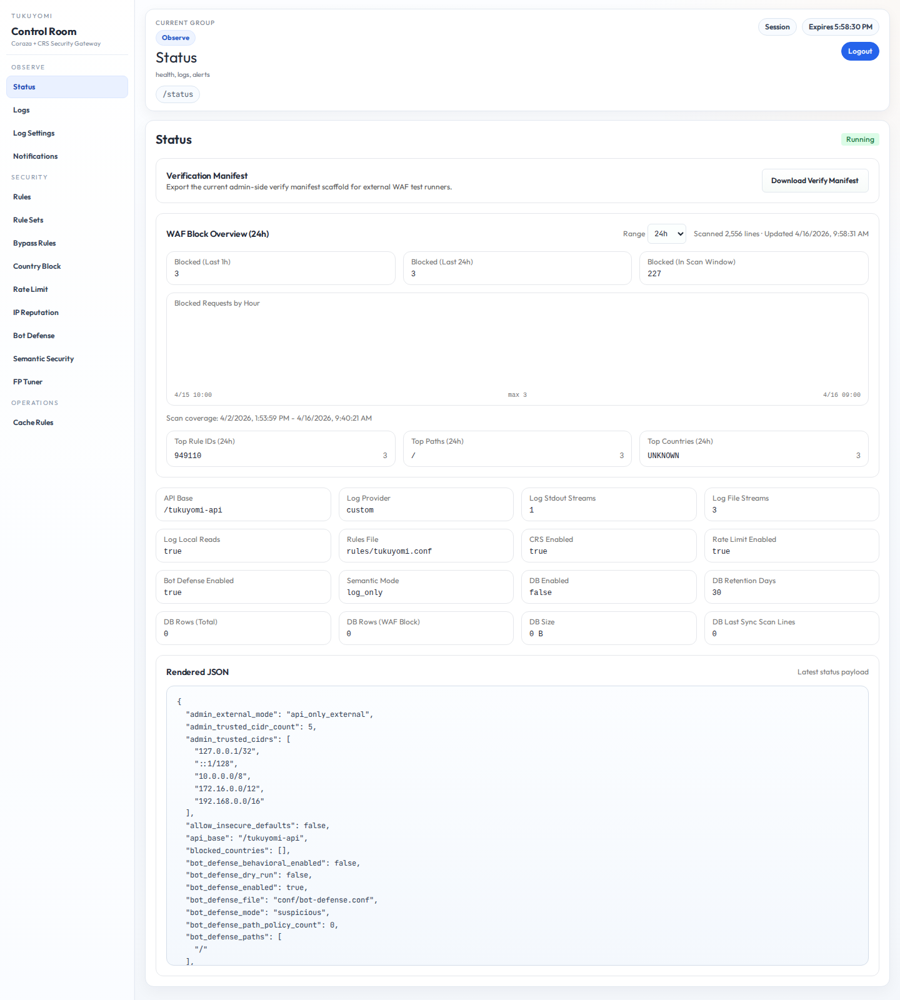
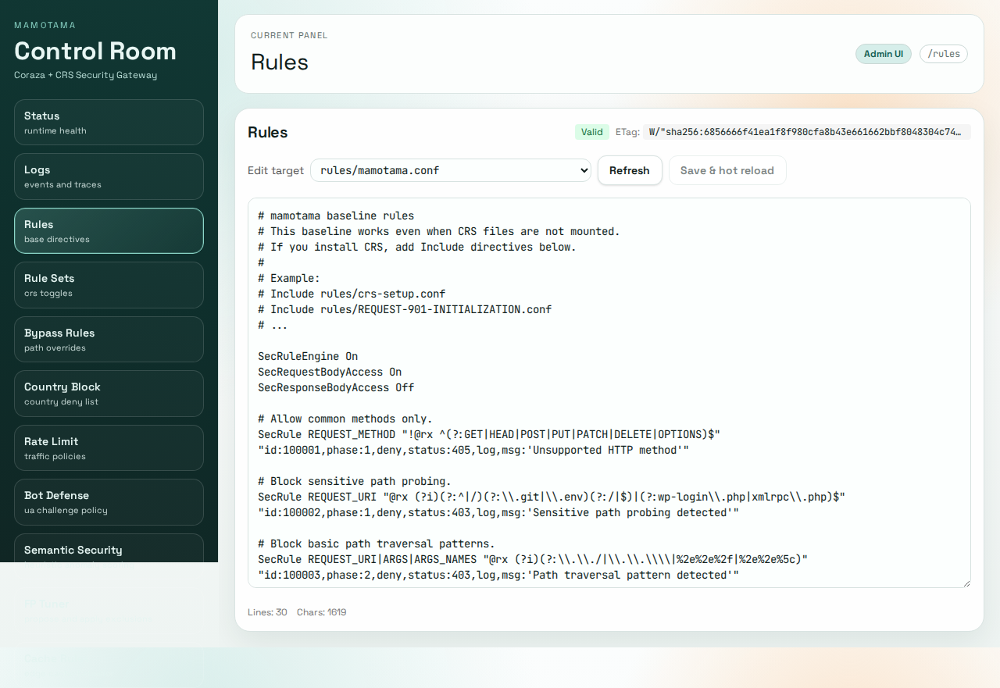
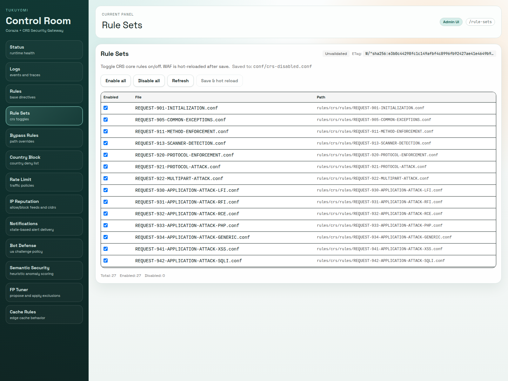
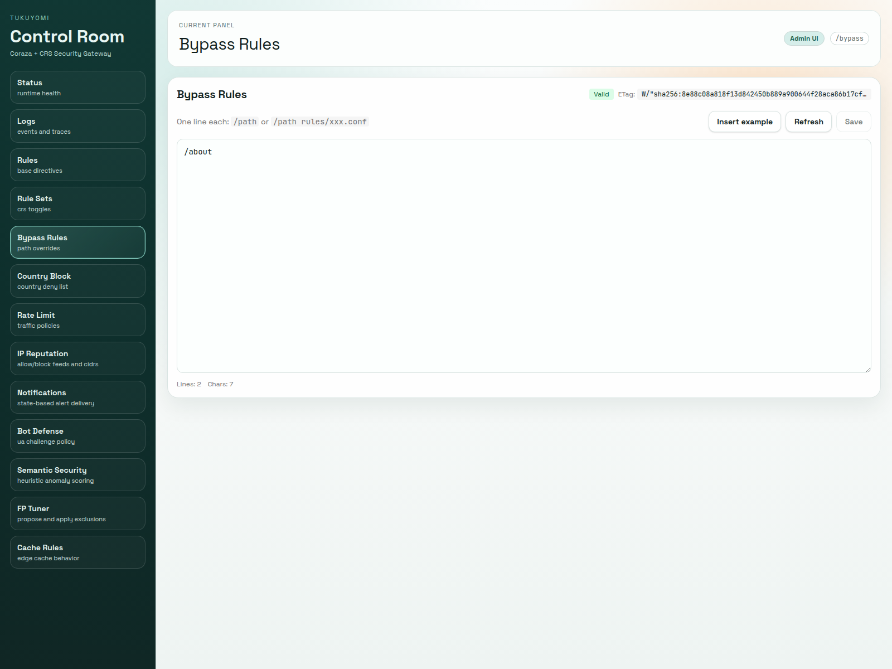
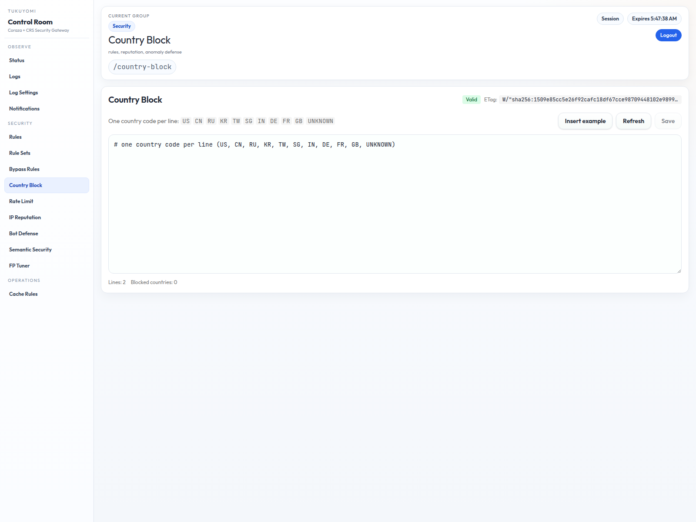
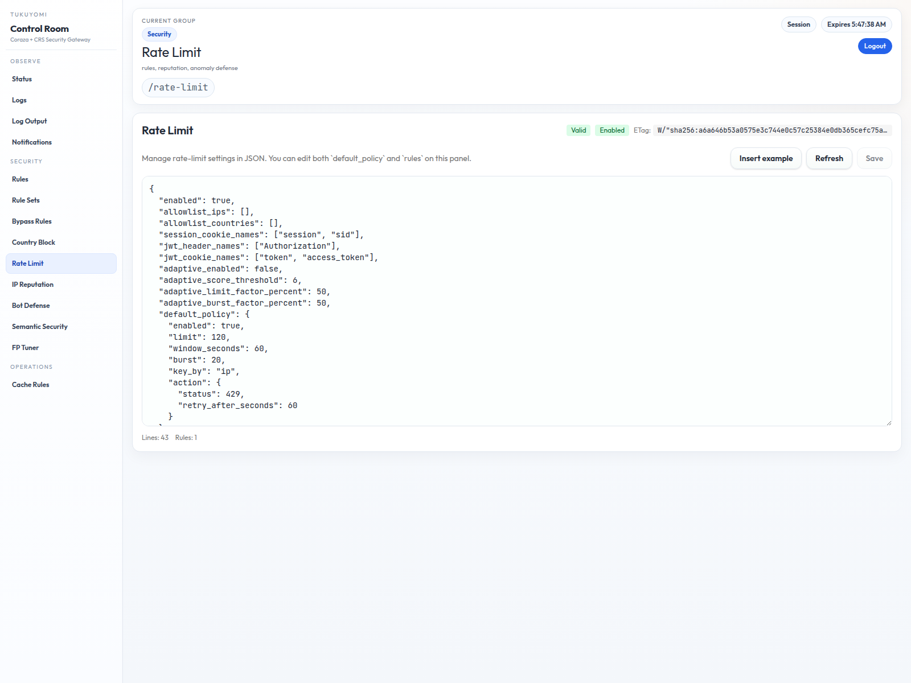
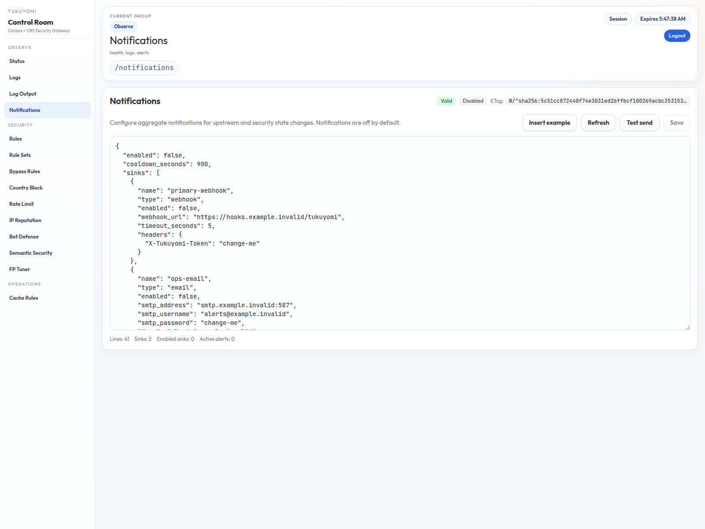
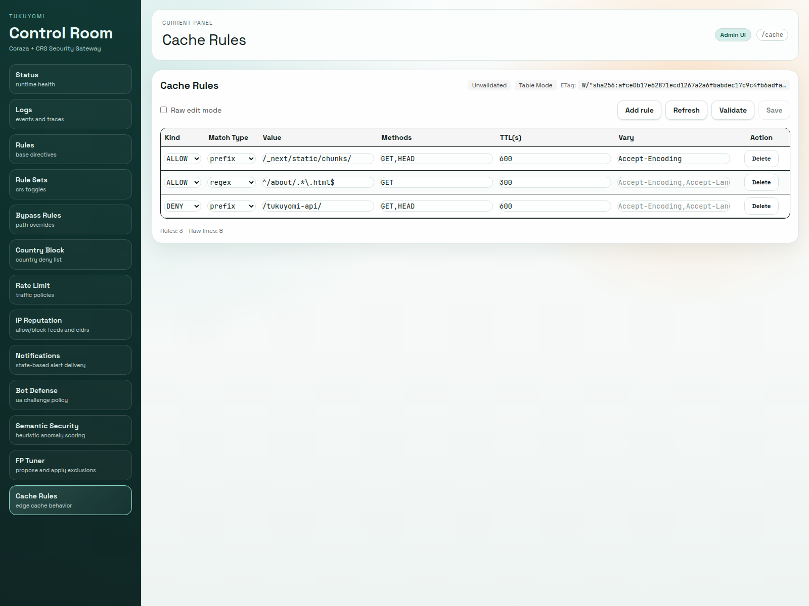
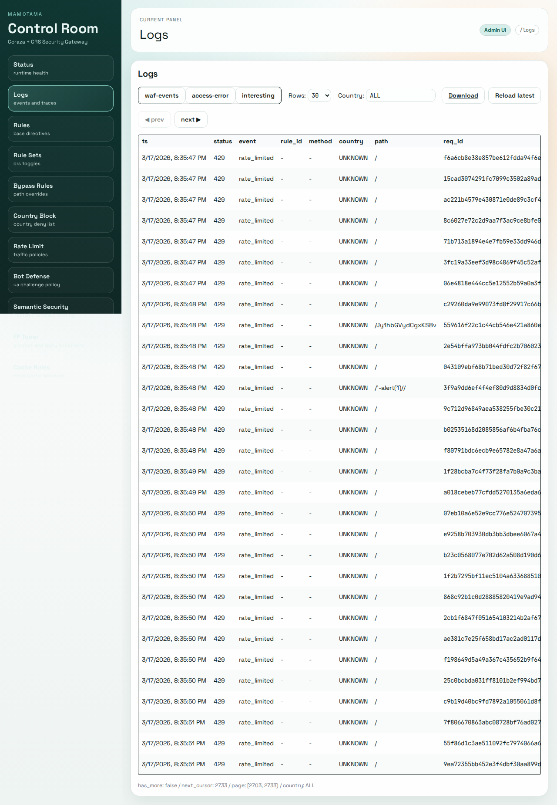

# tukuyomi

Coraza + CRS WAF project

[English](README.md) | [Japanese](README.ja.md)

## Overview

`tukuyomi` is a lightweight yet powerful application protection stack built with Coraza WAF and OWASP Core Rule Set (CRS).

## tukuyomi Ecosystem

`tukuyomi` is the OSS foundation of the tukuyomi security suite.  
Pre-built binaries for each component are published from the public [`tukuyomi-releases`](https://github.com/vril-dev/tukuyomi-releases/releases) repository.  
The repository-wide releases page is an index for the whole product family, while the table below links directly to the latest tagged release for each component.  
GitHub auto-generated source archives on those pages belong to the `tukuyomi-releases` repository itself.

| Component | Description | License | Distribution |
|---|---|---|---|
| tukuyomi | nginx + Coraza WAF (this repository) | Apache-2.0 | OSS |
| tukuyomi-proxy | Single-binary WAF/Proxy, no nginx required | MIT | [`v0.7.6`](https://github.com/vril-dev/tukuyomi-releases/releases/tag/v0.7.6) |
| tukuyomi-edge | Single-binary for IoT edge devices | MIT | [`v0.12.6`](https://github.com/vril-dev/tukuyomi-releases/releases/tag/v0.12.6) |
| tukuyomi-center | Single-binary for IoT center management | MIT | [`v0.6.4`](https://github.com/vril-dev/tukuyomi-releases/releases/tag/v0.6.4) |
| tukuyomi-verify | Verification and testing tool | MIT | [`v0.1.5`](https://github.com/vril-dev/tukuyomi-releases/releases/tag/v0.1.5) |

### Latest Binary Versions

| Component | Version | Updated |
|---|---|---|
| tukuyomi-proxy | v0.7.6 | 2026-04-02 |
| tukuyomi-edge | v0.12.6 | 2026-04-02 |
| tukuyomi-center | v0.6.4 | 2026-04-02 |
| tukuyomi-verify | v0.1.5 | 2026-04-02 |

> Version table is updated on each release.

## Product Positioning

`tukuyomi` is the Docker-first WAF stack in the family. It shares core security controls with `tukuyomi-proxy` and `tukuyomi-edge`, but its reverse proxy and TLS entrypoint are primarily delegated to `nginx`.

| Category | `tukuyomi` | `tukuyomi-proxy` | `tukuyomi-edge` |
| --- | --- | --- | --- |
| Runtime shape | Docker / compose | single binary or Docker | single binary / `systemd` |
| Reverse proxy + routes | `nginx` fronted, no built-in route editor | built-in gateway + route editor | built-in gateway + route editor |
| Core security controls | IP reputation, bot, semantic, rate, country | IP reputation, bot, semantic, rate, country | IP reputation, bot, semantic, rate, country |
| Device / center features | × | × | device auth + center link |
| Cache + bypass | `nginx` cache + bypass rules | internal cache + bypass rules | internal cache + bypass rules |
| TLS + admin UI | `nginx` TLS + separate frontend path | built-in TLS + embedded admin UI | built-in TLS + embedded admin UI |
| DB / multi-node | shared DB capable | shared DB capable | local node oriented |
| Host hardening | × | × | experimental L3/L4 host hardening |

Legend: `○`/`△`/`×` details and the full feature matrix are in [docs/product-comparison.md](docs/product-comparison.md).

---

## About Rule Files

To comply with licensing, this repository does **not** bundle the full OWASP CRS files.
Instead, it includes a minimal bootstrappable base rule file: `data/rules/tukuyomi.conf`.

### Setup

Fetch and place CRS files with the following script (default: `v4.23.0`):

```bash
./scripts/install_crs.sh
```

Specify a version:

```bash
./scripts/install_crs.sh v4.23.0
```

Edit `data/rules/crs/crs-setup.conf` as needed (for example, paranoia level and anomaly score settings).

### Preset Quick Start

Use the prepared minimal preset if you want a copy-ready baseline instead of starting from scratch:

```bash
make preset-apply PRESET=minimal
make preset-check PRESET=minimal
```

Edit `WAF_APP_URL`, `WAF_API_KEY_PRIMARY`, and `VITE_API_KEY` before exposing the stack outside local development.

---

## Environment Variables

You can control behavior via `.env`.

### Docker / Local MySQL (Optional)

| Variable | Example | Description |
| --- | --- | --- |
| `MYSQL_PORT` | `13306` | Host port mapped to MySQL container `3306` (used when profile `mysql` is enabled). |
| `MYSQL_DATABASE` | `tukuyomi` | Initial database name created in local MySQL container. |
| `MYSQL_USER` | `tukuyomi` | Application user created for local MySQL container. |
| `MYSQL_PASSWORD` | `tukuyomi` | Password for `MYSQL_USER`. |
| `MYSQL_ROOT_PASSWORD` | `tukuyomi-root` | Root password for local MySQL container. |
| `MYSQL_TZ` | `UTC` | Container timezone. |

### Nginx

| Variable | Example | Description |
| --- | --- | --- |
| `NGX_CORAZA_UPSTREAM` | `server coraza:9090;` | Upstream definition for Coraza (Go server). You can list multiple `server host:port;` lines for simple load balancing. |
| `NGX_BACKEND_RESPONSE_TIMEOUT` | `60s` | Upstream response timeout from Coraza. Applied to `proxy_read_timeout`. |
| `NGX_CORAZA_ADMIN_URL` | `/tukuyomi-admin/` | Public path for admin UI. Trailing slash required. Requests under this path are proxied to frontend (`web:5173`). |
| `NGX_CORAZA_API_BASEPATH` | `/tukuyomi-api/` | Base path for admin API. Trailing slash recommended. This path is always non-cacheable on nginx side. |

### WAF / Go (Coraza Wrapper)

| Variable | Example | Description |
| --- | --- | --- |
| `WAF_APP_URL` | `http://host.docker.internal:3000` | Upstream application URL (change appropriately for production such as ALB/ECS). |
| `WAF_PROXY_ERROR_HTML_FILE` | (empty) | Optional maintenance HTML file served when the upstream application is unavailable. |
| `WAF_PROXY_ERROR_REDIRECT_URL` | (empty) | Optional redirect target used when the upstream application is unavailable. |
| `WAF_LOG_FILE` | (empty) | WAF log output destination. If empty, stdout is used. |
| `WAF_BYPASS_FILE` | `conf/waf.bypass` | Path for bypass/special-rule definition file. |
| `WAF_BOT_DEFENSE_FILE` | `conf/bot-defense.conf` | Bot-defense challenge settings file (JSON), editable from admin UI. |
| `WAF_SEMANTIC_FILE` | `conf/semantic.conf` | Semantic heuristic scoring settings file (JSON), editable from admin UI. |
| `WAF_COUNTRY_BLOCK_FILE` | `conf/country-block.conf` | Country block definition file (one country code per line, e.g. `JP`, `US`, `UNKNOWN`). |
| `WAF_RATE_LIMIT_FILE` | `conf/rate-limit.conf` | Rate-limit definition file (JSON), editable from admin UI. |
| `WAF_IP_REPUTATION_FILE` | `conf/ip-reputation.conf` | IP reputation settings file (JSON), editable from admin UI. |
| `WAF_RULES_FILE` | `rules/tukuyomi.conf` | Active base rule file(s). Comma-separated multiple files are supported. |
| `WAF_CRS_ENABLE` | `true` | Whether to load CRS. If `false`, only base rules are used. |
| `WAF_CRS_SETUP_FILE` | `rules/crs/crs-setup.conf` | CRS setup file path. |
| `WAF_CRS_RULES_DIR` | `rules/crs/rules` | Directory for CRS core rules (`*.conf`). |
| `WAF_CRS_DISABLED_FILE` | `conf/crs-disabled.conf` | Disabled CRS core rule list file (one filename per line). |
| `WAF_FP_TUNER_MODE` | `mock` | FP tuner provider mode. `mock` reads fixture or generated suggestion, `http` posts to `WAF_FP_TUNER_ENDPOINT`. |
| `WAF_FP_TUNER_ENDPOINT` | (empty) | HTTP endpoint for external LLM proxy in `http` mode. |
| `WAF_FP_TUNER_API_KEY` | (empty) | Bearer token for `WAF_FP_TUNER_ENDPOINT`. |
| `WAF_FP_TUNER_MODEL` | (empty) | Optional model label passed to provider payload. |
| `WAF_FP_TUNER_TIMEOUT_SEC` | `15` | HTTP timeout (seconds) for provider calls. |
| `WAF_FP_TUNER_MOCK_RESPONSE_FILE` | `conf/fp-tuner-mock-response.json` | Mock provider response fixture path used in `mock` mode. |
| `WAF_FP_TUNER_REQUIRE_APPROVAL` | `true` | Require approval token for non-simulated apply (`/fp-tuner/apply` with `simulate=false`). |
| `WAF_FP_TUNER_APPROVAL_TTL_SEC` | `600` | Approval token TTL in seconds. |
| `WAF_FP_TUNER_AUDIT_FILE` | `logs/coraza/fp-tuner-audit.ndjson` | Audit log destination for propose/apply actions. |
| `WAF_STORAGE_BACKEND` | `file` | Storage backend selector. `file` keeps file-based operation; `db` enables DB-backed log store + config/rule blob sync. |
| `WAF_DB_DRIVER` | `sqlite` | DB driver when `WAF_STORAGE_BACKEND=db`. Supported: `sqlite`, `mysql` (implemented for log store and config/rule blobs). |
| `WAF_DB_ENABLED` | `false` | Legacy compatibility flag. If `WAF_STORAGE_BACKEND` is unset, `true` maps to `db` and `false` maps to `file`. |
| `WAF_DB_DSN` | (empty) | DSN for network DB drivers (for example MySQL). Required when `WAF_DB_DRIVER=mysql`; sqlite uses `WAF_DB_PATH`. |
| `WAF_DB_PATH` | `logs/coraza/tukuyomi.db` | SQLite file path used when `WAF_STORAGE_BACKEND=db` and `WAF_DB_DRIVER=sqlite`. |
| `WAF_DB_RETENTION_DAYS` | `30` | Retention window for `waf_events` in DB store. Entries older than this are pruned on sync. `0` disables pruning (config blobs are not pruned). |
| `WAF_DB_SYNC_INTERVAL_SEC` | `0` | Periodic DB→runtime sync interval in seconds. `0` disables background polling; `>=1` enables periodic reconciliation across multiple Coraza nodes. |
| `WAF_STRICT_OVERRIDE` | `false` | Behavior when a special-rule file fails to load. `true`: fail fast. `false`: warn and continue. |
| `WAF_API_BASEPATH` | `/tukuyomi-api` | Base path for admin API routing on Go server. |
| `WAF_API_KEY_PRIMARY` | `...` | Primary admin API key (`X-API-Key`). |
| `WAF_API_KEY_SECONDARY` | (empty) | Secondary key for rotation/fallback. Leave empty if unused. |
| `WAF_API_AUTH_DISABLE` | (empty) | Disable API auth flag. Keep empty (false) in production; use only for test environments. |
| `WAF_API_CORS_ALLOWED_ORIGINS` | `https://admin.example.com,http://localhost:5173` | Allowed CORS origins (comma-separated). If empty, CORS is disabled (same-origin only). |
| `WAF_ALLOW_INSECURE_DEFAULTS` | (empty) | Dev-only flag to allow weak API keys or disabled auth. Do not set in production. |

Upstream failure response behavior:
- If `WAF_PROXY_ERROR_HTML_FILE` and `WAF_PROXY_ERROR_REDIRECT_URL` are both unset, the wrapper returns the default `502 Bad Gateway` response and the browser shows a simple built-in error page.
- If `WAF_PROXY_ERROR_HTML_FILE` is set, HTML-capable clients receive that maintenance page and other clients receive plain text `503 Service Unavailable`.
- If `WAF_PROXY_ERROR_REDIRECT_URL` is set, `GET` / `HEAD` requests are redirected there and other methods receive plain text `503 Service Unavailable`.
- `WAF_PROXY_ERROR_HTML_FILE` and `WAF_PROXY_ERROR_REDIRECT_URL` are mutually exclusive; choose one per application.

### Admin UI (React / Vite)

| Variable | Example | Description |
| --- | --- | --- |
| `VITE_CORAZA_API_BASE` | `http://localhost/tukuyomi-api` | Full/relative API base path used by browser-side calls. |
| `VITE_APP_BASE_PATH` | `/tukuyomi-admin` | Admin UI root path (`react-router` basename). |
| `VITE_API_KEY` | `...` | API key attached by admin UI (`X-API-Key`). Usually same as `WAF_API_KEY_PRIMARY`. |

At startup, if `WAF_API_KEY_PRIMARY` is too short or known-weak, Coraza fails to start in secure mode.
For local testing only, you can temporarily relax this with `WAF_ALLOW_INSECURE_DEFAULTS=1`.

## Host Network Hardening (L3/L4 Basics)

tukuyomi focuses on application-layer (L7) protection.
Large volumetric L3/L4 attacks that saturate links cannot be mitigated by tukuyomi alone.
For internet-exposed deployments, combine it with upstream protections such as ISP, CDN, load balancer, or scrubbing services.

The following Linux kernel settings are a host-side hardening baseline for improving resilience against SYN floods and spoofed source traffic.
They are not a substitute for upstream DDoS mitigation.

`/etc/sysctl.d/99-tukuyomi-network-hardening.conf`

```conf
net.ipv4.tcp_syncookies = 1
net.ipv4.tcp_max_syn_backlog = 4096
net.core.somaxconn = 4096

net.ipv4.conf.all.accept_redirects = 0
net.ipv4.conf.default.accept_redirects = 0
net.ipv4.conf.all.send_redirects = 0
net.ipv4.conf.default.send_redirects = 0

# Assumes symmetric routing. Consider 2 for asymmetric routing, multi-NIC, or tunnel setups.
net.ipv4.conf.all.rp_filter = 1
net.ipv4.conf.default.rp_filter = 1
```

Apply:

```bash
sudo sysctl --system
```

Notes:

- `rp_filter=1` can break traffic in asymmetric routing environments
- `tcp_syncookies` is a fallback for SYN flood handling and does not prevent bandwidth exhaustion
- firewall / nftables / iptables rate limits should be tuned to real traffic, not copied blindly

---

## Admin Dashboard

`web/tukuyomi-admin/` contains the admin UI built with React + Vite.

### Main Screens and Features

| Path | Description |
| --- | --- |
| `/status` | WAF runtime status and configuration overview |
| `/logs` | Fetch and view WAF logs |
| `/rules` | View/edit active base rule files (`rules/tukuyomi.conf` etc.) |
| `/rule-sets` | Enable/disable CRS core rule files (`rules/crs/rules/*.conf`) |
| `/bypass` | View/edit bypass config directly (`waf.bypass`) |
| `/country-block` | View/edit country block config directly (`country-block.conf`) |
| `/rate-limit` | View/edit rate-limit config directly (`rate-limit.conf`) |
| `/ip-reputation` | View/edit IP reputation feeds and CIDR overrides directly (`conf/ip-reputation.conf`) |
| `/notifications` | View/edit aggregate notification config directly (`conf/notifications.conf`) |
| `/bot-defense` | View/edit bot-defense config directly (`bot-defense.conf`) |
| `/semantic` | View/edit semantic security config directly (`semantic.conf`) |
| `/cache` | Visual + raw editing for cache rules (`cache.conf`), with Validate/Save |

### Screenshots

#### Dashboard


#### Rules Editor


#### Rule Sets


#### Bypass Rules


#### Country Block


#### Rate Limit


#### Notifications


#### Cache Rules


#### Logs


### Libraries

- coraza 3.3.3
- nginx 1.27
- go 1.26.0
- React 19
- Vite 7
- Tailwind CSS
- react-router-dom
- ShadCN UI (Tailwind-based UI)

### Startup

```bash
make setup
make compose-build
make web-up
make compose-up
```

You can change the root path by setting `VITE_APP_BASE_PATH` and `VITE_CORAZA_API_BASE` in `.env`.

#### Optional: Local MySQL Container (profile: `mysql`)

For future DB-driver validation, you can start a local MySQL container:

```bash
make mysql-up
```

When using MySQL for DB-backed logs/configs, set `WAF_STORAGE_BACKEND=db`, `WAF_DB_DRIVER=mysql`, and `WAF_DB_DSN` (for example `tukuyomi:tukuyomi@tcp(mysql:3306)/tukuyomi?charset=utf8mb4&parseTime=true`).

For multi-node operation, set `WAF_DB_SYNC_INTERVAL_SEC` (for example `10`) so each node periodically reconciles runtime files from `config_blobs` and applies reload only when content actually changes.

Scale-out note: for multiple Coraza nodes, use a shared MySQL backend (`db + mysql`) as the standard setup. `file` and `db + sqlite` are intended for single-node or local validation use.

### WAF Regression Test (GoTestWAF)

Run the local regression test:

```bash
make gotestwaf-file
```

Prerequisites:

- Docker and Docker Compose are available.
- The script automatically builds/starts `coraza` and `nginx`.
- Default host ports are `HOST_CORAZA_PORT=19090` and `HOST_NGINX_PORT=18080`.
- Legacy `HOST_OPENRESTY_PORT` is still accepted for compatibility.
- The first run may take longer because the GoTestWAF image is pulled.

Default gate is `MIN_BLOCKED_RATIO=70`. Optional extra gates:

```bash
MIN_TRUE_NEGATIVE_PASSED_RATIO=95 MAX_FALSE_POSITIVE_RATIO=5 MAX_BYPASS_RATIO=30 ./scripts/run_gotestwaf.sh
```

Reports are written to `data/logs/gotestwaf/`:

- JSON full report: `gotestwaf-report.json`
- Markdown summary: `gotestwaf-report-summary.md`
- Key-value summary: `gotestwaf-report-summary.txt`

### Deployment Examples

Practical example stacks are available under:

- `examples/nextjs` (Next.js frontend)
- `examples/wordpress` (WordPress + high-paranoia CRS setup)
- `examples/api-gateway` (REST API + strict rate-limit profile)

See `examples/README.md` for common setup flow. `examples/api-gateway`, `examples/nextjs`, and `examples/wordpress` include `PROTECTED_HOST=protected.example.test ./smoke.sh`, and repo-level Docker smoke runs are available via `./scripts/ci_example_smoke.sh <example>`.
If you want a single entrypoint from the repo root, use `make example-smoke EXAMPLE=api-gateway` or `make example-smoke-all`.

### FP Tuner Mock Flow

You can test send/receive/apply flow without an external LLM contract:

```bash
./scripts/test_fp_tuner_mock.sh
```

Default is simulate-only apply (`SIMULATE=1`). To actually append and hot-reload:

```bash
SIMULATE=0 ./scripts/test_fp_tuner_mock.sh
```

### FP Tuner HTTP Stub Flow

You can also run HTTP provider mode with a local stub endpoint:

```bash
./scripts/test_fp_tuner_http.sh
```

What this script does:

- Starts a local temporary provider stub on `127.0.0.1:${MOCK_PROVIDER_PORT:-18091}`
- Starts/rebuilds `coraza` in `WAF_FP_TUNER_MODE=http`
- Sends `propose` / `apply` requests and checks response contract
- Verifies provider-bound payload is masked before external send

Default host API port is `HOST_CORAZA_PORT=19090` (no `:80` dependency).

### FP Tuner Command Bridge Flow

For external-tool integration (including future Codex CLI / Claude Code workflows), run the provider bridge in `command` mode:

```bash
./scripts/test_fp_tuner_bridge_command.sh
```

Related scripts:

- `scripts/fp_tuner_provider_bridge.py`: local HTTP bridge (`/propose`)
- `scripts/fp_tuner_provider_cmd_example.sh`: example command provider (stdin JSON -> stdout JSON)
- `scripts/fp_tuner_provider_openai.sh`: OpenAI-compatible command provider (stdin JSON -> API call -> stdout JSON)
- `scripts/fp_tuner_provider_claude.sh`: Claude Messages API command provider (stdin JSON -> API call -> stdout JSON)

You can replace `BRIDGE_COMMAND` with your own command that outputs proposal JSON:

```bash
BRIDGE_COMMAND="/path/to/your-provider-command.sh" ./scripts/test_fp_tuner_bridge_command.sh
```

OpenAI command provider example:

```bash
export FP_TUNER_OPENAI_API_KEY="<your-api-key>"
export FP_TUNER_OPENAI_MODEL="<your-model-name>"

BRIDGE_COMMAND="./scripts/fp_tuner_provider_openai.sh" ./scripts/test_fp_tuner_bridge_command.sh
```

Local mock test for the OpenAI command provider:

```bash
./scripts/test_fp_tuner_openai_command.sh
```

Claude command provider example:

```bash
export FP_TUNER_CLAUDE_API_KEY="<your-api-key>"
export FP_TUNER_CLAUDE_MODEL="claude-sonnet-4-6"

BRIDGE_COMMAND="./scripts/fp_tuner_provider_claude.sh" ./scripts/test_fp_tuner_bridge_command.sh
```

Local mock test for the Claude command provider:

```bash
./scripts/test_fp_tuner_claude_command.sh
```

### FP Tuner Admin UI Flow

The admin panel (`/fp-tuner`) now supports choosing one `waf_block` event directly from recent logs.

Typical flow:

1. Open `FP Tuner` in admin UI.
2. In `Pick From Recent waf_block Logs`, click `Use` on the event you want to tune.
3. Confirm populated event fields (`path`, `rule_id`, `matched_variable`, `matched_value`).
4. Click `Propose`, review/edit `proposal.rule_line`.
5. Click `Apply` (`simulate` first, then real apply with approval token if required).

This keeps external provider payload small by sending one selected event at a time.

---

## Admin API Endpoints (`/tukuyomi-api`)

### Endpoint List

Detailed request/response schemas are available in [docs/api/admin-openapi.yaml](docs/api/admin-openapi.yaml) (OpenAPI 3.0, Swagger-compatible).

| Method | Path | Description |
| --- | --- | --- |
| GET | `/tukuyomi-api/status` | Get current WAF status/config |
| GET | `/tukuyomi-api/metrics` | Export Prometheus-style runtime counters for rate limit and semantic scoring |
| GET | `/tukuyomi-api/logs/read` | Read WAF logs (`tail`) with optional country filter via `country` query |
| GET | `/tukuyomi-api/logs/stats` | Return WAF block summary + hourly series (`hours`, `scan` query supported) |
| GET | `/tukuyomi-api/logs/download` | Download log files (`waf` / `accerr` / `intr`) as ZIP |
| GET | `/tukuyomi-api/rules` | Get active rule files (multi-file aware) |
| POST | `/tukuyomi-api/rules:validate` | Validate rule syntax (no save) |
| PUT | `/tukuyomi-api/rules` | Save rule file and hot-reload base WAF (`If-Match` supported) |
| GET | `/tukuyomi-api/crs-rule-sets` | Get CRS rule list and enabled/disabled state |
| POST | `/tukuyomi-api/crs-rule-sets:validate` | Validate CRS selection (no save) |
| PUT | `/tukuyomi-api/crs-rule-sets` | Save CRS selection and hot-reload (`If-Match` supported) |
| GET | `/tukuyomi-api/bypass-rules` | Get bypass file content |
| POST | `/tukuyomi-api/bypass-rules:validate` | Validate bypass content only (no save) |
| PUT | `/tukuyomi-api/bypass-rules` | Save bypass file (`If-Match` optimistic lock via `ETag`) |
| GET | `/tukuyomi-api/country-block-rules` | Get country block file content |
| POST | `/tukuyomi-api/country-block-rules:validate` | Validate country block file (no save) |
| PUT | `/tukuyomi-api/country-block-rules` | Save country block file (`If-Match` optimistic lock via `ETag`) |
| GET | `/tukuyomi-api/rate-limit-rules` | Get rate-limit config file |
| POST | `/tukuyomi-api/rate-limit-rules:validate` | Validate rate-limit config (no save) |
| PUT | `/tukuyomi-api/rate-limit-rules` | Save rate-limit config (`If-Match` optimistic lock via `ETag`) |
| GET | `/tukuyomi-api/notifications` | Get aggregate notification config file |
| GET | `/tukuyomi-api/notifications/status` | Get notification runtime status and active alert states |
| POST | `/tukuyomi-api/notifications/validate` | Validate notification config (no save) |
| POST | `/tukuyomi-api/notifications/test` | Send a test notification using current runtime config |
| PUT | `/tukuyomi-api/notifications` | Save notification config (`If-Match` optimistic lock via `ETag`) |
| GET | `/tukuyomi-api/ip-reputation` | Get IP reputation config and runtime status |
| POST | `/tukuyomi-api/ip-reputation:validate` | Validate IP reputation config (no save) |
| PUT | `/tukuyomi-api/ip-reputation` | Save IP reputation config (`If-Match` optimistic lock via `ETag`) |
| GET | `/tukuyomi-api/bot-defense-rules` | Get bot-defense config file |
| POST | `/tukuyomi-api/bot-defense-rules:validate` | Validate bot-defense config (no save) |
| PUT | `/tukuyomi-api/bot-defense-rules` | Save bot-defense config (`If-Match` optimistic lock via `ETag`) |
| GET | `/tukuyomi-api/semantic-rules` | Get semantic security config and runtime stats |
| POST | `/tukuyomi-api/semantic-rules:validate` | Validate semantic config (no save) |
| PUT | `/tukuyomi-api/semantic-rules` | Save semantic config (`If-Match` optimistic lock via `ETag`) |
| GET | `/tukuyomi-api/verify-manifest` | Export a verification manifest scaffold for external WAF test runners |
| POST | `/tukuyomi-api/fp-tuner/propose` | Build FP tuning proposal from request payload (`event` or `events[]`) or latest `waf_block` / `semantic_anomaly` log event |
| POST | `/tukuyomi-api/fp-tuner/apply` | Validate/apply proposed scoped exclusion rule (`simulate=true` by default, approval token required for real apply when enabled) |
| GET | `/tukuyomi-api/cache-rules` | Return `cache.conf` raw + structured data with `ETag` |
| POST | `/tukuyomi-api/cache-rules:validate` | Validate cache config (no save) |
| PUT | `/tukuyomi-api/cache-rules` | Save `cache.conf` (`If-Match` optimistic lock via `ETag`) |

If logs or rules are missing, API returns `500` with `{"error":"..."}`.

---

## WAF Bypass / Special Rule Settings

`tukuyomi` supports request-level WAF bypass and path-specific special rule application.

### Bypass File Location

Specify with environment variable `WAF_BYPASS_FILE` (default: `conf/waf.bypass`).

### File Format

```text
# Normal bypass entries
/about/
/about/user.php

# Special rule application (do not bypass WAF; apply the given rule file)
/about/admin.php rules/admin-rule.conf

# Comment lines (starting with #)
#/should/be/ignored.php rules/test.conf
```

### Edit from UI

You can directly edit and save `waf.bypass` from dashboard `/bypass`.

### Country Block Settings

You can edit `WAF_COUNTRY_BLOCK_FILE` (default: `conf/country-block.conf`) from `/country-block`.
Use one country code per line (`JP`, `US`, `UNKNOWN`).
Matched countries are blocked with `403` before WAF inspection.

### Rate Limit Settings

You can edit `WAF_RATE_LIMIT_FILE` (default: `conf/rate-limit.conf`) from `/rate-limit`.
Configuration format is JSON with `default_policy` and `rules`.
On exceed, response uses `action.status` (typically `429`) and includes `Retry-After` header.

### IP Reputation Settings

You can edit `WAF_IP_REPUTATION_FILE` (default: `conf/ip-reputation.conf`) from `/ip-reputation`.
Request-time security plugins run in order `ip_reputation -> bot_defense -> semantic` before WAF inspection.
The config supports static allow/block CIDRs plus optional feed refresh.
Plugin authoring notes are in [`docs/request_security_plugins.md`](docs/request_security_plugins.md).

#### JSON Parameter Quick Reference (what changes what)

| Parameter | Example | Effect |
| --- | --- | --- |
| `enabled` | `true` / `false` | Enables/disables rate limit globally. `false` means pass-through. |
| `allowlist_ips` | `["127.0.0.1/32", "10.0.0.5"]` | Always exempt matching IP/CIDR from rate limiting. |
| `allowlist_countries` | `["JP", "US"]` | Always exempt matching country codes. |
| `session_cookie_names` | `["session", "sid"]` | Cookie names checked when `key_by` uses session identity. |
| `jwt_header_names` | `["Authorization"]` | Header names checked for JWT subject extraction. |
| `jwt_cookie_names` | `["token", "access_token"]` | Cookie names checked for JWT subject extraction. |
| `adaptive_enabled` | `true` / `false` | Tighten rate limits automatically when semantic risk score is high. |
| `adaptive_score_threshold` | `6` | Minimum semantic risk score that activates adaptive throttling. |
| `adaptive_limit_factor_percent` | `50` | Percentage applied to `limit` when adaptive mode is active. |
| `adaptive_burst_factor_percent` | `50` | Percentage applied to `burst` when adaptive mode is active. |
| `default_policy.enabled` | `true` | Enable/disable default policy itself. |
| `default_policy.limit` | `120` | Base allowed requests per window. |
| `default_policy.burst` | `20` | Additional burst allowance. Effective cap is `limit + burst`. |
| `default_policy.window_seconds` | `60` | Window size in seconds. Smaller is stricter. |
| `default_policy.key_by` | `"ip"` | Aggregation key: `ip` / `country` / `ip_country` / `session` / `ip_session` / `jwt_sub` / `ip_jwt_sub`. |
| `default_policy.action.status` | `429` | HTTP status on exceed (`4xx`/`5xx`). |
| `default_policy.action.retry_after_seconds` | `60` | `Retry-After` value in seconds. If `0`, remaining window time is auto-calculated. |
| `rules[]` | see below | Overrides `default_policy` when matched. Evaluated top-down. |
| `rules[].match_type` | `"prefix"` | Match type: `exact` / `prefix` / `regex`. |
| `rules[].match_value` | `"/login"` | Match target according to type. |
| `rules[].methods` | `["POST"]` | Restrict methods. Empty means all methods. |
| `rules[].policy.*` |  | Policy fields used when this rule matches. |

#### Typical Tuning

- Temporarily disable globally: set `enabled=false`
- Improve spike tolerance: increase `burst`
- Apply per-login or per-user throttling: set `key_by="session"` or `key_by="jwt_sub"`
- Tighten suspicious clients automatically: enable `adaptive_enabled`
- Tighten login path: add a rule with `match_type=prefix`, `match_value=/login`, `methods=["POST"]`
- Separate by IP + country: set `key_by="ip_country"`
- Exempt trusted locations: add to `allowlist_ips` or `allowlist_countries`

#### Recommended Settings

- General public traffic: keep `default_policy.key_by="ip"`
- Browser login/forms with stable session cookies: use `key_by="session"`
- Authenticated APIs with stable trusted JWT `sub`: use `key_by="jwt_sub"`
- Start adaptive throttling on higher-risk login or write paths first: `adaptive_enabled=true`, `adaptive_score_threshold=6`, `adaptive_limit_factor_percent=50`, `adaptive_burst_factor_percent=50`

Oversized JWT header/cookie values are ignored for `jwt_sub` extraction and are not base64-decoded or JSON-parsed.

#### Monitoring Points

- Watch `/tukuyomi-api/metrics` for sustained increases in rate-limit blocked and adaptive counters
- Watch `/tukuyomi-api/metrics` for semantic action counters around login and write endpoints
- Inspect logs for `rl_key_hash`, `adaptive`, `risk_score`, `reason_list`, and `score_breakdown` when tuning false positives or throttling

### Notifications

You can edit `WAF_NOTIFICATION_FILE` (default: `conf/notifications.conf`) from `/notifications`.
Notifications are disabled by default and emit only on aggregate state transitions, not on every blocked request.

- upstream notifications aggregate repeated proxy errors and transition `quiet -> active -> escalated -> quiet(recovered)`
- security notifications aggregate `waf_block`, `rate_limited`, `semantic_anomaly`, `bot_challenge`, and `ip_reputation` events and transition `quiet -> active -> escalated -> quiet(recovered)`
- supported sinks are `webhook` and `email`
- `POST /tukuyomi-api/notifications/test` sends a test notification using the current runtime config
- `GET /tukuyomi-api/notifications/status` shows active alert states, sink counts, and the last dispatch error

#### JSON Parameter Quick Reference

| Parameter | Example | Effect |
| --- | --- | --- |
| `enabled` | `true` / `false` | Enables/disables notification dispatch globally. Default is `false`. |
| `cooldown_seconds` | `900` | Minimum seconds between sends for the same alert key/state progression. |
| `sinks[].type` | `"webhook"` / `"email"` | Delivery backend. |
| `sinks[].enabled` | `true` / `false` | Enables/disables an individual sink. |
| `sinks[].webhook_url` | `"https://hooks.example.invalid/tukuyomi"` | Target URL for webhook delivery. |
| `sinks[].headers` | `{"X-Tukuyomi-Token":"..."}` | Optional webhook headers. |
| `sinks[].smtp_address` | `"smtp.example.invalid:587"` | SMTP relay used by email sink. |
| `sinks[].from` / `sinks[].to` | `"alerts@example.invalid"` / `["secops@example.invalid"]` | Email sender and recipients. |
| `upstream.window_seconds` | `60` | Aggregation window for proxy error counting. |
| `upstream.active_threshold` | `3` | Count that moves upstream alert state from `quiet` to `active`. |
| `upstream.escalated_threshold` | `10` | Count that moves upstream alert state from `active` to `escalated`. |
| `security.window_seconds` | `300` | Aggregation window for security event counting. |
| `security.active_threshold` | `20` | Count that moves security alert state from `quiet` to `active`. |
| `security.escalated_threshold` | `100` | Count that moves security alert state from `active` to `escalated`. |
| `security.sources` | `["waf_block","rate_limited"]` | Security event types included in aggregate tracking. |

#### Recommended Settings

- keep notifications disabled until webhook/email delivery has been verified with `POST /tukuyomi-api/notifications/test`
- start with webhook delivery first; Slack / Teams can usually consume the webhook sink directly
- enable upstream notifications first on public reverse-proxy traffic to catch sustained backend outages without per-request noise
- enable security notifications only after rate-limit / semantic thresholds have been tuned enough to avoid false-positive floods

Example:

```json
{
  "enabled": false,
  "cooldown_seconds": 900,
  "sinks": [
    {
      "name": "primary-webhook",
      "type": "webhook",
      "enabled": false,
      "webhook_url": "https://hooks.example.invalid/tukuyomi",
      "timeout_seconds": 5
    }
  ],
  "upstream": {
    "enabled": true,
    "window_seconds": 60,
    "active_threshold": 3,
    "escalated_threshold": 10
  },
  "security": {
    "enabled": true,
    "window_seconds": 300,
    "active_threshold": 20,
    "escalated_threshold": 100,
    "sources": ["waf_block", "rate_limited", "semantic_anomaly", "bot_challenge"]
  }
}
```

### Bot Defense Settings

You can edit `WAF_BOT_DEFENSE_FILE` (default: `conf/bot-defense.conf`) from `/bot-defense`.
When enabled, suspicious (or all, depending on mode) browser-like GET requests on matched paths receive a challenge response before WAF inspection.

#### JSON Parameter Quick Reference

| Parameter | Example | Effect |
| --- | --- | --- |
| `enabled` | `true` / `false` | Enables/disables bot challenge globally. |
| `mode` | `"suspicious"` | `suspicious` checks UA patterns, `always` challenges all matched requests. |
| `path_prefixes` | `["/", "/login"]` | Apply challenge only to matching request paths. |
| `exempt_cidrs` | `["127.0.0.1/32"]` | Skip challenge for trusted source IP/CIDR. |
| `suspicious_user_agents` | `["curl", "wget"]` | UA substrings used in `suspicious` mode. |
| `challenge_cookie_name` | `"__tukuyomi_bot_ok"` | Cookie name used for challenge pass state. |
| `challenge_secret` | `"long-random-secret"` | Signing secret for challenge token (empty = ephemeral per process). |
| `challenge_ttl_seconds` | `86400` | Token validity period in seconds. |
| `challenge_status_code` | `429` | HTTP status returned on challenge response (`4xx/5xx`). |

### Semantic Security Settings

You can edit `WAF_SEMANTIC_FILE` (default: `conf/semantic.conf`) from `/semantic`.
This is a heuristic detector (rule-based, non-ML) with staged enforcement: `off | log_only | challenge | block`.

#### JSON Parameter Quick Reference

| Parameter | Example | Effect |
| --- | --- | --- |
| `enabled` | `true` / `false` | Enables/disables semantic scoring pipeline. |
| `mode` | `"challenge"` | Enforcement stage: `off` / `log_only` / `challenge` / `block`. |
| `exempt_path_prefixes` | `["/healthz"]` | Skip semantic scoring for matching paths. |
| `log_threshold` | `4` | Minimum score to emit semantic anomaly log. |
| `challenge_threshold` | `7` | Minimum score to issue semantic challenge in `challenge` mode. |
| `block_threshold` | `9` | Minimum score to hard-block (`403`) in `block` mode. |
| `max_inspect_body` | `16384` | Max request body bytes inspected by semantic scoring. |
| `temporal_window_seconds` | `10` | Sliding window used for per-IP temporal observations. |
| `temporal_max_entries_per_ip` | `128` | Max in-memory observations kept per IP within the temporal window. |
| `temporal_burst_threshold` | `20` | Request-count threshold for `temporal:ip_burst`. |
| `temporal_burst_score` | `2` | Score added when `temporal:ip_burst` fires. |
| `temporal_path_fanout_threshold` | `8` | Distinct-path threshold for `temporal:ip_path_fanout`. |
| `temporal_path_fanout_score` | `2` | Score added when `temporal:ip_path_fanout` fires. |
| `temporal_ua_churn_threshold` | `4` | Distinct-User-Agent threshold for `temporal:ip_ua_churn`. |
| `temporal_ua_churn_score` | `1` | Score added when `temporal:ip_ua_churn` fires. |

`semantic_anomaly` logs include `reason_list` and `score_breakdown`, and `/tukuyomi-api/metrics` exposes Prometheus-style counters for rate limiting and semantic actions.

### Rule File Editing (multi-file aware)

Dashboard `/rules` edits active base rule set (`WAF_RULES_FILE` and, when CRS enabled, `crs-setup.conf` + enabled `*.conf` under `WAF_CRS_RULES_DIR`).
Before save, server-side syntax validation is performed. Successful save hot-reloads base WAF.
If reload fails, automatic rollback is applied.

### CRS Rule Set Toggle

Dashboard `/rule-sets` toggles each file under `rules/crs/rules/*.conf`.
State is persisted to `WAF_CRS_DISABLED_FILE` and WAF is hot-reloaded on save.

### Priority

- Special-rule entries take precedence (bypass entries on same path are ignored)
- If rule file does not exist:
  - `WAF_STRICT_OVERRIDE=true`: fail immediately (`log.Fatalf`)
  - `false` or unset: log warning and continue with normal rules

### Example

```text
/about/                    # bypass everything under /about/
/about/admin.php rules/special.conf  # only admin.php uses special rule via WAF
```

### Notes

- Rules are evaluated top-to-bottom in file order
- Lines with `extraRuleFile` are prioritized
- Comment lines (`#...`) are ignored

---

## Log Retrieval

Logs are available via API.

```bash
curl -s -H "X-API-Key: <your-api-key>" \
     "http://<host>/tukuyomi-api/logs/read?src=waf&tail=100&country=JP" | jq .
```

- `src`: log type (`waf`, `accerr`, `intr`)
- `tail`: number of lines
- `country`: country code filter (`JP`, `US`, `UNKNOWN`). Omit or set `ALL` for all records.
  - Under Cloudflare, `CF-IPCountry` header is used. If unavailable, `UNKNOWN` is used.

Use the API key configured in `.env`.
For production, always enforce access controls and authentication.

## Cache Feature

You can dynamically configure cache target paths and TTL.

### Config File

Cache config is stored in `/data/conf/cache.conf`.
Hot reload is supported; changes apply right after saving the file.

#### Example

```bash
# Cache static assets (CSS/JS/images) for 10 minutes
ALLOW prefix=/_next/static/chunks/ methods=GET,HEAD ttl=600 vary=Accept-Encoding

# Cache specific HTML pages for 5 minutes (regex)
ALLOW regex=^/about/.*.html$ methods=GET ttl=300

# Deny cache for all API paths (safe default)
DENY prefix=/tukuyomi-api/

# Deny cache for authenticated user profile pages (regex)
DENY regex=^/users/[0-9]+/profile

# Everything else defaults to non-cache
```

- `ALLOW`: cache enabled (`ttl` in seconds, optional `vary`)
- `DENY`: excluded from cache
- Recommended methods are `GET`/`HEAD` (`POST` etc. are not cached)

Field details:
- `prefix`: match request path prefix
- `regex`: regex match (`^` and `$` supported)
- `methods`: target HTTP methods (comma-separated)
- `ttl`: cache duration in seconds
- `vary`: `Vary` header values for nginx (comma-separated)

### Behavior Summary

- Go side sets `X-Tukuyomi-Cacheable` and `X-Accel-Expires` on responses matching cache rules
- nginx controls cache based on those headers
- Requests with auth headers, cookies, or API paths are non-cacheable by default
- Upstream responses containing `Set-Cookie` are not stored (to prevent shared-cache leakage)

### How to Verify

Check response headers:
- `X-Tukuyomi-Cacheable: 1`
- `X-Accel-Expires: <seconds>`

You can inspect cache hit state using nginx `X-Cache-Status` header (`MISS`/`HIT`/`BYPASS`, etc.).

---

## Admin UI Access Restrictions

This project does not include access control by default.
If you expose admin UI (`NGX_CORAZA_ADMIN_URL`), always configure access controls such as Basic Auth and/or IP restrictions.

---

## Quality Gates (CI)

GitHub Actions workflow `ci` validates:

- `go test ./...` (`coraza/src`)
- `docker compose config` sanity check
- MySQL log-store integration test (`go test ./internal/handler -run TestLogsStatsMySQLStoreAggregatesAndIngestsIncrementally`, with `docker compose --profile mysql up -d mysql`)
- `./scripts/run_gotestwaf.sh` (`waf-test` matrix, `MIN_BLOCKED_RATIO=70`, `WAF_DB_ENABLED=false/true`)

In production workflows, set these as required branch protection checks:

- `ci / go-test`
- `ci / mysql-logstore-test`
- `ci / compose-validate`
- `ci / waf-test (file)`
- `ci / waf-test (sqlite)`

---

## False Positive Tuning

See:

- `docs/operations/waf-tuning.md`
- `docs/operations/fp-tuner-api.md`

## DB Operations

SQLite operation notes:

- `docs/operations/db-ops.md`

---

## What Is tukuyomi?

**tukuyomi** evolves from **mamotama**, an OSS WAF built on nginx + Coraza WAF.

The name is inspired by **「護りたまえ」(mamoritamae)**,
meaning *"grant protection"*.

While mamotama focused on protection as its core principle,
tukuyomi represents a more structured and intelligent approach —
bringing order, observability, and control to web systems.
