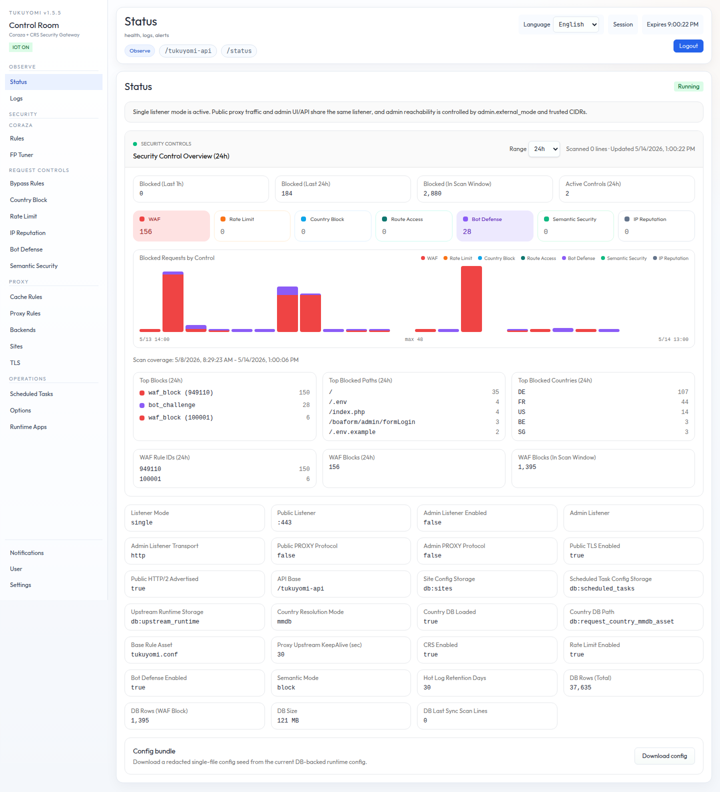

# tukuyomi

Coraza + CRS WAF reverse proxy / API gateway

[English](README.md) | [Japanese](README.ja.md)



## Overview

`tukuyomi` is the general-purpose reverse proxy / API gateway in the Tukuyomi family.
It combines Coraza WAF + OWASP CRS with built-in route management, embedded admin UI/API,
optional static and PHP-FPM hosting, cache, and app-edge policy controls.

It is designed for operators who want one product to cover:

- reverse proxy and route management
- WAF and false-positive tuning
- rate, country, bot, semantic, and IP reputation controls
- built-in admin UI/API
- optional static hosting, PHP-FPM, and scheduled jobs
- single-binary or Docker deployment

## Product Positioning

`tukuyomi` is now the canonical application-edge WAF / reverse proxy product.
The former `tukuyomi-proxy` line has been integrated into this repository and
continues here under the `tukuyomi` product name.

Archived `tukuyomi-proxy` binary releases remain available from
`tukuyomi-releases`, but that repository is no longer the update channel for
proxy/WAF development. New proxy, routing, cache, WAF tuning, PHP-FPM, and
scheduled task work belongs to `tukuyomi`.

See [docs/product-comparison.md](docs/product-comparison.md) for the current
family comparison.

## Rule Files and First Setup

This repository intentionally does **not** bundle the full OWASP CRS files.
It ships a minimal bootstrappable base rule seed under `seeds/waf/rules/`.

Prepare the DB first, then install CRS seed files and import WAF rule assets:

```bash
make db-migrate
make crs-install
```

Use a prepared baseline if you want a copy-ready preset for the embedded admin UI and
default upstream wiring:

```bash
make preset-apply PRESET=minimal
make preset-check PRESET=minimal
```

The bundled `minimal` preset stages only `.env` and `data/conf/config.json`.
When `conf/proxy.json` / `conf/sites.json` are absent, `make db-import` seeds
from `seeds/conf/` before falling back to compatibility defaults.

Before first DB import, replace the sample values in any seed files you want to
bootstrap from:

- `data/conf/config.json` for DB connection bootstrap
- `seeds/conf/*.json` as the bundled production seed set for an empty DB
- `data/conf/proxy.json` as the initial proxy rules seed/import file
- `data/conf/sites.json` as the initial site seed/import file when site ownership / TLS is enabled
- `data/conf/scheduled-tasks.json` as the initial scheduled task seed/import file when scheduled tasks are enabled

Then run `make db-import` before starting production so the remaining config
seeds are stored in the DB. `make crs-install` already runs after
`make db-migrate` and imports WAF/CRS rule assets into DB. After import,
production startup requires `data/conf/config.json` for DB bootstrap plus the DB
rows; the other seed JSON/rule files are not runtime authority.

## Quick Start

### Install

For a direct Linux host install, start with the install target:

```bash
make install TARGET=linux-systemd
```

This builds the embedded Admin UI and Go binary, creates the runtime tree, runs
DB migration, imports WAF/CRS assets, seeds first-run DB config, and installs
systemd units for the local host. The scheduled-task timer is enabled by
default; set `INSTALL_ENABLE_SCHEDULED_TASKS=0` if this host should not execute
scheduled tasks.

For detailed install options such as `PREFIX`, `INSTALL_USER`, scheduled task
units, or container/platform deployment instead of host install, see:

- [docs/build/binary-deployment.md](docs/build/binary-deployment.md)
- [docs/build/container-deployment.md](docs/build/container-deployment.md)

### Local Test Preview

If you only want to test the Admin UI and local runtime flow, use the preview
target:

```bash
make preset-apply PRESET=minimal
make ui-preview-up
```

`make ui-preview-up` runs the CRS ensure flow automatically; that flow runs
`make db-migrate`, installs CRS seed files when missing, and imports WAF rule
assets into DB.

Then open:

- Admin UI: `http://localhost:9090/tukuyomi-ui`
- Admin API: `http://localhost:9090/tukuyomi-api`

By default, `make ui-preview-up` uses an isolated preview SQLite DB and resets
that DB plus preview config files on each start. If you use
`UI_PREVIEW_PERSIST=1`, preview-specific config and DB state are kept across
`ui-preview-down` / `ui-preview-up`.

### Runtime Config Model

`tukuyomi` keeps configuration split by responsibility:

- `.env`: Docker-only runtime wiring
- `data/conf/config.json`: DB connection bootstrap; bundled configs keep only the `storage` block
- DB `app_config_*`: global runtime, listener, admin, storage policy, and path config
- DB `proxy_*`: live proxy transport and routing config
- `seeds/conf/*`: bundled empty-DB production seeds used when configured seed files are absent
- `data/conf/proxy.json`: proxy rules seed/import/export material
- DB `proxy_backend_pools` / `proxy_backend_pool_members`: route-scoped balancing groups built from named upstream members
- `data/conf/upstream-runtime.json`: seed/import/export material for opt-in runtime overrides from `Proxy Rules > Upstreams`
- `data/conf/sites.json`: site ownership and TLS binding seed/import/export material
- DB `vhosts` / `vhost_*`: live Runtime Apps config; storage names remain `vhost` for compatibility
- DB `waf_rule_assets`: base WAF and CRS rule/data assets
- DB `override_rules`: managed bypass `extra_rule` rule bodies
- DB `php_runtime_inventory` / `php_runtime_modules`: PHP-FPM runtime inventory and module metadata
- DB `psgi_runtime_inventory` / `psgi_runtime_modules`: Perl/Starman runtime inventory and module metadata
- `data/php-fpm/inventory.json` and `data/php-fpm/vhosts.json`: PHP-FPM and Runtime Apps seed/import/export material
- `data/psgi/inventory.json`: PSGI runtime seed/import/export material
- `data/conf/scheduled-tasks.json`: scheduled task seed/import/export material

Base WAF/CRS assets and managed bypass overrides are DB-backed. `make crs-install`
stages rule import material under `data/tmp`, imports it, and removes the stage.
The configured paths remain logical asset names and compatibility references;
runtime does not use `data/rules`, `data/conf/rules`, or `data/geoip` fallback
directories. The same applies to startup, policy, site, Runtime Apps, scheduled task,
upstream runtime, response cache, and PHP-FPM inventory domains after
`make db-import`.

For the detailed operator model, see:

- [docs/reference/operator-reference.md](docs/reference/operator-reference.md)
- [docs/operations/listener-topology.md](docs/operations/listener-topology.md)

`Proxy Rules > Upstreams` is the catalog for direct backend nodes outside
Runtime Apps. PHP-FPM/PSGI application backends that are owned by Tukuyomi
Runtime Apps are not configured there; move those listen host/docroot/runtime
settings to `Runtime Apps` instead.
`Proxy Rules > Backend Pools` groups direct routable upstream names into
route-scoped balancing sets, and routes normally bind to `action.backend_pool`.
`Backends` lists direct upstream backend objects used by routing and keeps
runtime operations on those direct named upstream nodes themselves.

In the structured `Proxy Rules` editor, the operator workflow is shown in this
order:

1. `Upstreams`
2. `Backend Pools`
3. `Routes` / `Default route`

Each `Upstreams` row provides its own `Probe` action so connectivity checks are
run against a specific configured upstream instead of a generic panel-wide
target.

Direct named upstreams from `Proxy Rules > Upstreams` can be drained, disabled,
or given a runtime weight override from `Backends` without editing
`proxy.json`. Proxy rule edits persist to DB `proxy_rules`; runtime-only backend
overrides live in DB `upstream_runtime` and use `data/conf/upstream-runtime.json`
only as seed/import/export material.

For route-scoped web balancing outside Runtime Apps, define backend nodes in
`upstreams[]`, group them in `backend_pools[]`, then bind routes to those pools
with `action.backend_pool`.

For Runtime Apps-owned applications, define the runtime listener in `Runtime Apps`.
The runtime creates a generated backend from the configured listen host and
port. `Proxy Rules` remains responsible for routing traffic to that generated
upstream target. Configured upstream URLs in `Proxy Rules > Upstreams` are never
rebound or rewritten by Runtime Apps. Runtime enable/drain/disable and runtime weight
override remain limited to direct named upstreams shown in `Backends`.

Standard `http://` and `https://` upstream proxying automatically adds:

- `X-Forwarded-For`
- `X-Forwarded-Host`
- `X-Forwarded-Proto`

Optional `emit_upstream_name_request_header=true` also adds:

- `X-Tukuyomi-Upstream-Name`

This internal observability header is emitted only when the final target is a
configured named upstream from `Proxy Rules > Upstreams`. Direct route URLs and
generated Runtime Apps targets do not receive it, and route-level `request_headers`
cannot override it.

### Minimal Route-Scoped Backend Pool Example

```json
{
  "upstreams": [
    { "name": "localhost1", "url": "http://127.0.0.1:8081", "weight": 1, "enabled": true },
    { "name": "localhost2", "url": "http://127.0.0.1:8082", "weight": 1, "enabled": true },
    { "name": "localhost3", "url": "http://127.0.0.1:9081", "weight": 1, "enabled": true },
    { "name": "localhost4", "url": "http://127.0.0.1:9082", "weight": 1, "enabled": true }
  ],
  "backend_pools": [
    { "name": "site-localhost", "strategy": "round_robin", "members": ["localhost1", "localhost2"] },
    { "name": "site-app", "strategy": "round_robin", "members": ["localhost3", "localhost4"] }
  ],
  "routes": [
    { "name": "site-localhost", "priority": 10, "match": { "hosts": ["localhost"] }, "action": { "backend_pool": "site-localhost" } },
    { "name": "site-app", "priority": 20, "match": { "hosts": ["app"] }, "action": { "backend_pool": "site-app" } }
  ]
}
```

## Deployment Guides

Choose one of these deployment models:

- Single binary / systemd:
  - [docs/build/binary-deployment.md](docs/build/binary-deployment.md)
- Docker / container platforms:
  - [docs/build/container-deployment.md](docs/build/container-deployment.md)
- Split public/admin listener example:
  - [docs/build/config.split-listener.example.json](docs/build/config.split-listener.example.json)

Container platform examples:

- ECS single-instance:
  - [docs/build/ecs-single-instance.task-definition.example.json](docs/build/ecs-single-instance.task-definition.example.json)
  - [docs/build/ecs-single-instance.service.example.json](docs/build/ecs-single-instance.service.example.json)
- Kubernetes single-instance:
  - [docs/build/kubernetes-single-instance.example.yaml](docs/build/kubernetes-single-instance.example.yaml)
- Azure Container Apps single-instance:
  - [docs/build/azure-container-apps-single-instance.example.yaml](docs/build/azure-container-apps-single-instance.example.yaml)

## Documentation Map

### Core Operator Reference

- Operator reference:
  - [docs/reference/operator-reference.md](docs/reference/operator-reference.md)
- Admin API OpenAPI:
  - [docs/api/admin-openapi.yaml](docs/api/admin-openapi.yaml)
- Request security plugin model:
  - [docs/request_security_plugins.md](docs/request_security_plugins.md)

### Security and Tuning

- WAF tuning:
  - [docs/operations/waf-tuning.md](docs/operations/waf-tuning.md)
- FP Tuner API contract:
  - [docs/operations/fp-tuner-api.md](docs/operations/fp-tuner-api.md)
- Upstream HTTP/2 and h2c:
  - [docs/operations/upstream-http2.md](docs/operations/upstream-http2.md)
- Static fastpath evaluation:
  - [docs/operations/static-fastpath-evaluation.md](docs/operations/static-fastpath-evaluation.md)

### PHP, PSGI, and Scheduled Tasks

- PHP-FPM runtime and Runtime Apps:
  - [docs/operations/php-fpm-vhosts.md](docs/operations/php-fpm-vhosts.md)
- PSGI Runtime Apps and Movable Type:
  - [docs/operations/psgi-vhosts.md](docs/operations/psgi-vhosts.md)
- Scheduled tasks and scheduler deployment:
  - [docs/operations/php-scheduled-tasks.md](docs/operations/php-scheduled-tasks.md)

### Database, Metrics, and Regression

- DB operations:
  - [docs/operations/db-ops.md](docs/operations/db-ops.md)
- Benchmark baseline:
  - [docs/operations/benchmark-baseline.md](docs/operations/benchmark-baseline.md)
- Regression matrix:
  - [docs/operations/regression-matrix.md](docs/operations/regression-matrix.md)
- Release binary smoke:
  - [docs/operations/release-binary-smoke.md](docs/operations/release-binary-smoke.md)

## Quality Gates

Local verification:

```bash
make ci-local
```

Extended local regression, including deployment-guide replay:

```bash
make ci-local-extended
```

Typical required checks in CI are:

- `ci / go-test`
- `ci / mysql-logstore-test`
- `ci / ui-test`
- `ci / compose-validate`
- `ci / waf-test (sqlite)`

## License

tukuyomi is released under the BSD 2-Clause License, the same permissive license
family used by nginx. See [LICENSE](LICENSE).

Third-party dependency notices are listed in [NOTICE](NOTICE). Dependency
license metadata is available through `server/go.mod` / `server/go.sum`
and `web/tukuyomi-admin/package-lock.json`.

## What Is tukuyomi?

**tukuyomi** evolves from **mamotama**, an OSS WAF built on nginx + Coraza WAF.

The name is inspired by **「護りたまえ」(mamoritamae)**, meaning *"grant protection"*.
While mamotama focused on protection as its core principle, tukuyomi represents a
more structured and operationally visible approach to web protection.
