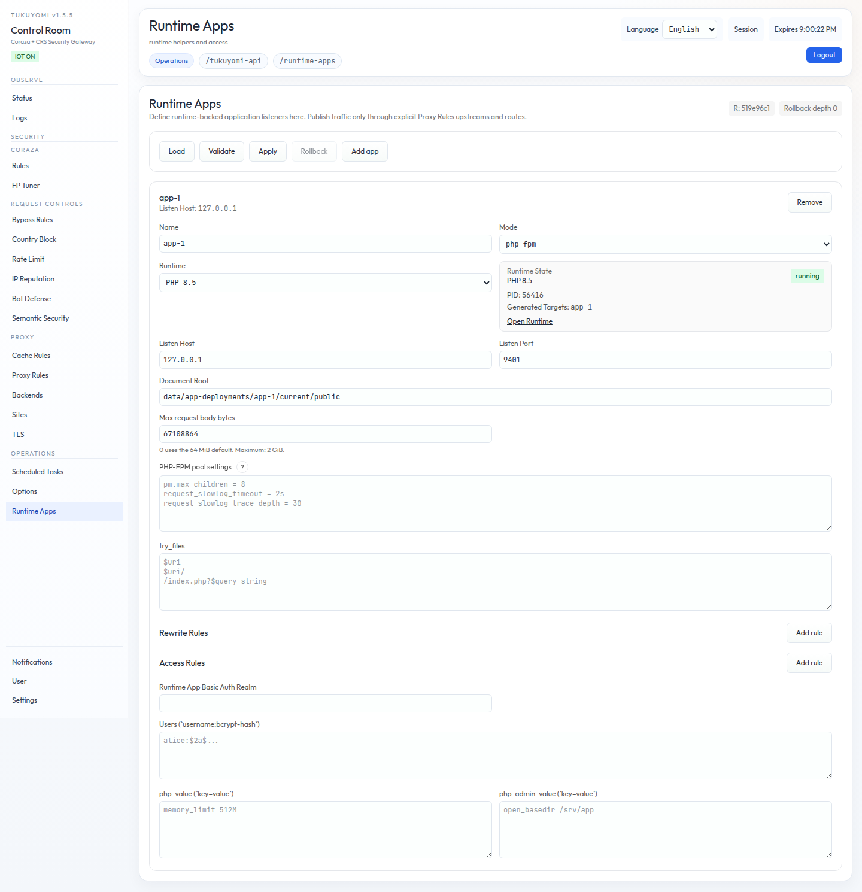

# Chapter 10. PHP-FPM runtime and Runtime Apps

Part V begins. From this chapter on, we cover **the application layer
that runs after the edge**. We start with the PHP-FPM runtime and the
Runtime Apps that bundle them.

Tukuyomi's Runtime Apps live across three screens:

- **`/options`**: a screen for managing **built runtimes** (PHP /
  PSGI / etc.).
- **`/runtime-apps`**: a screen for managing **listen / docroot /
  rewrite / access** for each runtime.
- **`/proxy-rules`**: the screen that decides **how routing reaches
  the generated backends published by Runtime Apps** from the edge.

This chapter uses PHP-FPM as the worked example to lay out the
relationship between these three screens, where data lives, the
process lifecycle, and the boundary between Upstreams and Runtime
Apps.



## 10.1 Separation of concerns

The three screens, in one line each:

- **`/options`**
  - Lists built runtimes.
  - Confirms materialization state and process state.
- **`/runtime-apps`**
  - Manages **`php-fpm` application definitions**.
  - Handles runtime listen host, FastCGI listen port, docroot, runtime,
    rewrites, access rules, basic auth, and PHP ini overrides.
  - Manages the **generated backends**.
- **`/proxy-rules`**
  - Manages **direct backends / backend pools / explicit routes** that
    Runtime Apps do not own.
  - Connection settings for PHP-FPM apps move out of `/proxy-rules` and
    into `/runtime-apps`.
  - The configured upstream URL is **not rewritten** by `/runtime-apps`.
  - **Do not use raw `fcgi://` as a routine entry point.**

In other words, the listener and vhost configuration for PHP-FPM lives
in **Runtime Apps only**, and Proxy Rules only handles how that surface
is exposed at the edge.

## 10.2 Data layout

PHP-FPM operations data is collected under `data/php-fpm/`:

- `inventory.json`
  - Local metadata for the runtime inventory.
- `vhosts.json`
  - Managed PHP-FPM Runtime App definitions.
- `binaries/<runtime_id>/`
  - Built runtime bundles.
  - `php-fpm` wrapper, `php` CLI wrapper, `runtime.json`,
    `modules.json`.
- `runtime/<runtime_id>/`
  - Generated `php-fpm.conf`, pool files, pid / log, listen artifacts.

A generic sample docroot lives at `data/vhosts/samples/`.

The default paths come from the effective DB `app_config`:

- `paths.php_runtime_inventory_file`
- `paths.vhost_config_file`

As repeatedly noted in Chapter 3, these JSON files are **seed /
import / export material for an empty DB**. After import, the DB is
the source of truth.

## 10.3 Runtime build and inventory flow

A PHP runtime **only appears in `/options` after it has been built**.
The standard build command:

```bash
make php-fpm-build VER=8.3
```

To stage into a binary deployment layout:

```bash
sudo make php-fpm-copy RUNTIME=php83
```

To safely remove from a binary deployment layout:

```bash
sudo make php-fpm-prune RUNTIME=php83
```

Supported versions:

- `8.3`
- `8.4`
- `8.5`

### 10.3.1 Verification after build

1. Open `/options`.
2. Confirm a runtime card is shown.
3. On the card, confirm:
   - Display name / detected version
   - Binary path
   - CLI binary path
   - Bundled module list
   - Run user / group
   - Number of references from materialized targets
   - Runtime process state
4. Run `Load` to refresh the listing.

If you delete `data/php-fpm/binaries/<runtime_id>/`, the runtime
**disappears from `/options` on the next `Load`**.

### 10.3.2 Notes

- The default destination for `php-fpm-copy` is `/opt/tukuyomi`.
  Override with `DEST=/srv/tukuyomi` and the like.
- The default destination for `php-fpm-prune` is also
  `/opt/tukuyomi`. Confirm the Runtime App references in the staged
  `vhosts.json` and the running PIDs before deleting.
- **Docker is required only at runtime-bundle build time.** Once the
  bundle is in place, the runtime does not need Docker.
- Operators rebuild and replace the bundle to pick up security
  updates for PHP / base image library / PECL extensions.
- The bundled runtime ships with the major DB extensions:
  - `sqlite3`, `pdo_sqlite`
  - `mysqli`, `pdo_mysql`, `mysqlnd`
  - `pgsql`, `pdo_pgsql`
- The bundled module list is visible from `/options` or by running
  `data/php-fpm/binaries/<runtime_id>/php -m`.

## 10.4 Runtime App flow

Managed PHP-FPM application definitions are managed at
`/runtime-apps`. **`/runtime-apps` is shown only when at least one
built runtime exists.**

### 10.4.1 Runtime App fields

Required:

- `name`
- `hostname`
- `listen_port`
- `document_root`
- `runtime_id`

Optional:

- `try_files`
- Rewrite rules
- Access rules
- Runtime-App-wide basic auth
- Per-access-rule basic auth
- `php_value`
- `php_admin_value`

### 10.4.2 Basic flow

1. Open `/runtime-apps`.
2. Add a Runtime App.
3. Fill in the required fields.
4. Add rewrite / access / auth / ini as needed.
5. Run **`Validate`**.
6. Run **`Apply`**.
7. Use **`Rollback`** only when you need to revert to the most
   recently saved state.

Runtime App behavior is **centralized configuration like nginx**.
Files like `.htaccess` inside the document root are **not parsed,
imported, watched, or reloaded on request**. The legacy
`override_file_name` field is read only for migration purposes and
disappears from the saved form on validate / apply.

The split takes a moment to get used to if you are coming from
`.htaccess` culture, but tukuyomi's Runtime Apps is built on the
premise that **the same vhost configuration is handled with
validate / apply / rollback**. That is the design decision that lets
operators review changes through the UI and trace who changed what.

## 10.5 The boundary between Upstreams and Runtime Apps

**Stop placing PHP-FPM applications as direct backends in `Proxy Rules
> Upstreams`**. Connection settings move into `/runtime-apps`. This is
the most important takeaway in Part V.

| Screen | What it owns |
|---|---|
| `Proxy Rules > Upstreams` | **Direct backends not owned by Runtime Apps**, such as external HTTP / HTTPS backends. The configured upstream URL is treated as written, and Runtime Apps cannot redirect it elsewhere. |
| `/runtime-apps` | **Runtime listen host, docroot, runtime, FastCGI listen port** for PHP-FPM / static apps. Saving exposes the generated backend to the effective runtime. |

So:

- **Hand-writing PHP-FPM vhost in Upstreams** → stop.
- **Define them in Runtime Apps and wait for the generated backend to
  appear at the edge** → this is the path forward.

## 10.6 The generated Runtime App backend

When you save a Runtime App, a **generated backend** is exposed for
the configured listener. **Note that the JSON `hostname` is the
listen host / address of the runtime, not a VirtualHost name or a
Host header match.**

What happens after a Runtime App is saved:

1. `/runtime-apps` writes the definition to
   `data/php-fpm/vhosts.json`.
2. The runtime layer generates pool / config under
   `data/php-fpm/runtime/<runtime_id>/`.
3. A **generated upstream named `generated_target`** is added to the
   effective proxy runtime.
4. The configured upstream URL in `Proxy Rules > Upstreams` is **not
   modified**.
5. To send traffic to the Runtime App-backed application, the operator
   selects the generated upstream from a route or default route in
   `Proxy Rules`.

`Proxy Rules` controls the route precedence (Chapter 5):

- Explicit `routes[]`
- The generated site host fallback route
- `default_route`
- `upstreams[]`

Notes:

- `hostname` and `listen_port` are the **PHP-FPM FastCGI listen
  target**.
- They are **not treated as an HTTP upstream** like
  `http://<hostname>:<listen_port>`.
- `generated_target` is the server-owned name for the generated backend
  alias / pool. **The admin UI does not show it as operator input.**
- In normal operation, `Proxy Rules` routes to the generated upstream
  target.

Because the generated upstream target represents the listener,
**you do not need to hand-write a raw `fcgi://` URL** anywhere.

## 10.7 Process lifecycle

When at least one `php-fpm` Runtime App is enabled, tukuyomi
**supervises one `php-fpm` master process per `runtime_id`**.

- Adding or modifying a `php-fpm` Runtime App may **start or restart**
  the runtime.
- Deleting **the last referencing Runtime App** stops the runtime.
- Runtime state is visible at `/options`.

You can also drive lifecycle explicitly:

```bash
make php-fpm-up     RUNTIME=php83
make php-fpm-reload RUNTIME=php83
make php-fpm-down   RUNTIME=php83
```

Remove an unreferenced runtime bundle with:

```bash
make php-fpm-remove RUNTIME=php83
```

The runtime starts under a **dedicated, non-root user / group** as
configured.

## 10.8 Tests / smoke

Two dedicated commands are available:

```bash
make php-fpm-test
make php-fpm-smoke VER=8.3
```

After PHP-FPM-related changes, at minimum confirm that these pass
locally before pushing to production.

## 10.9 Recap

- Keep the responsibilities of `/options` / `/runtime-apps` /
  `/proxy-rules` distinct.
- Do not hand-write PHP-FPM vhosts in Upstreams. **Runtime Apps
  publishes the generated backend.**
- Build runtime bundles with `make php-fpm-build VER=...`, stage them
  with `make php-fpm-copy`.
- The `php-fpm` master process is **supervised per `runtime_id`**.
- The model is validate / apply / rollback on the UI, not
  `.htaccess`.

## 10.10 Bridge to the next chapter

Chapter 11 covers the other runtime — **PSGI (Perl / Starman)
Runtime Apps**. For readers with Movable Type assets, that is the
chapter to decide whether to migrate.
