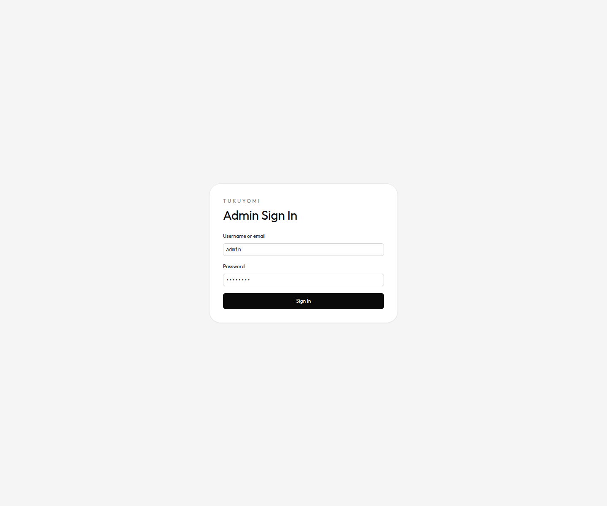
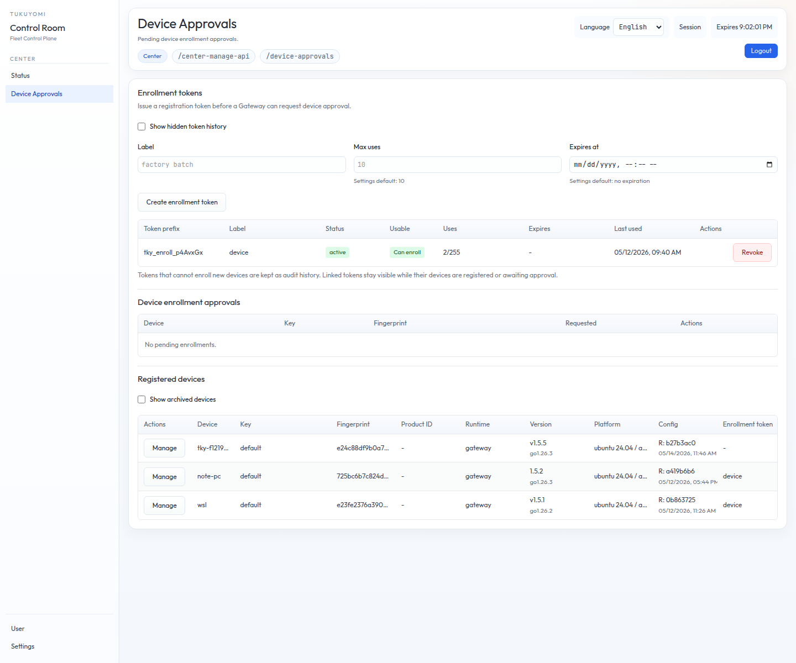
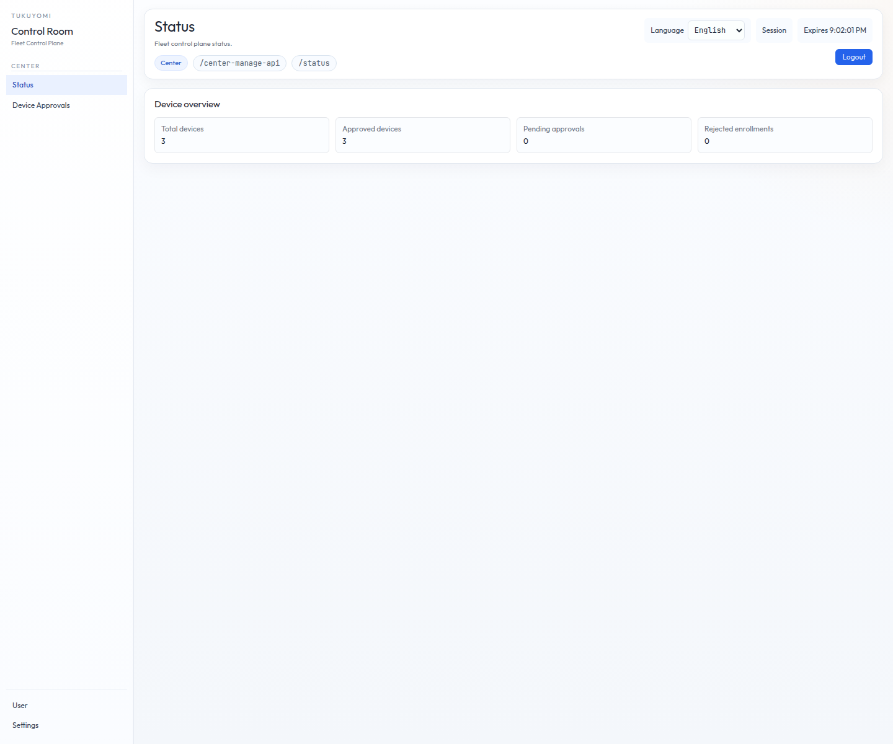
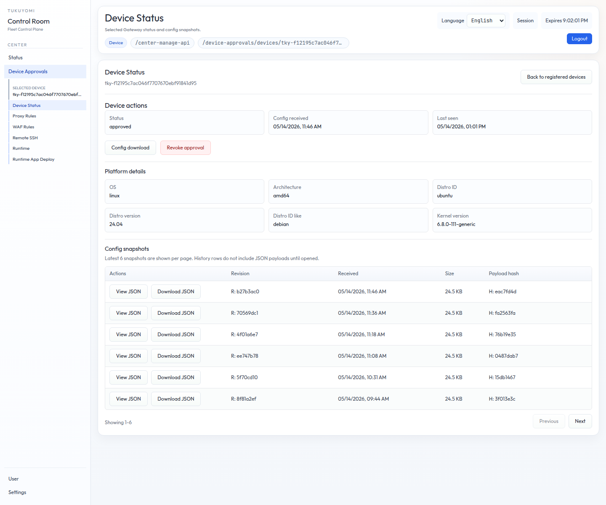
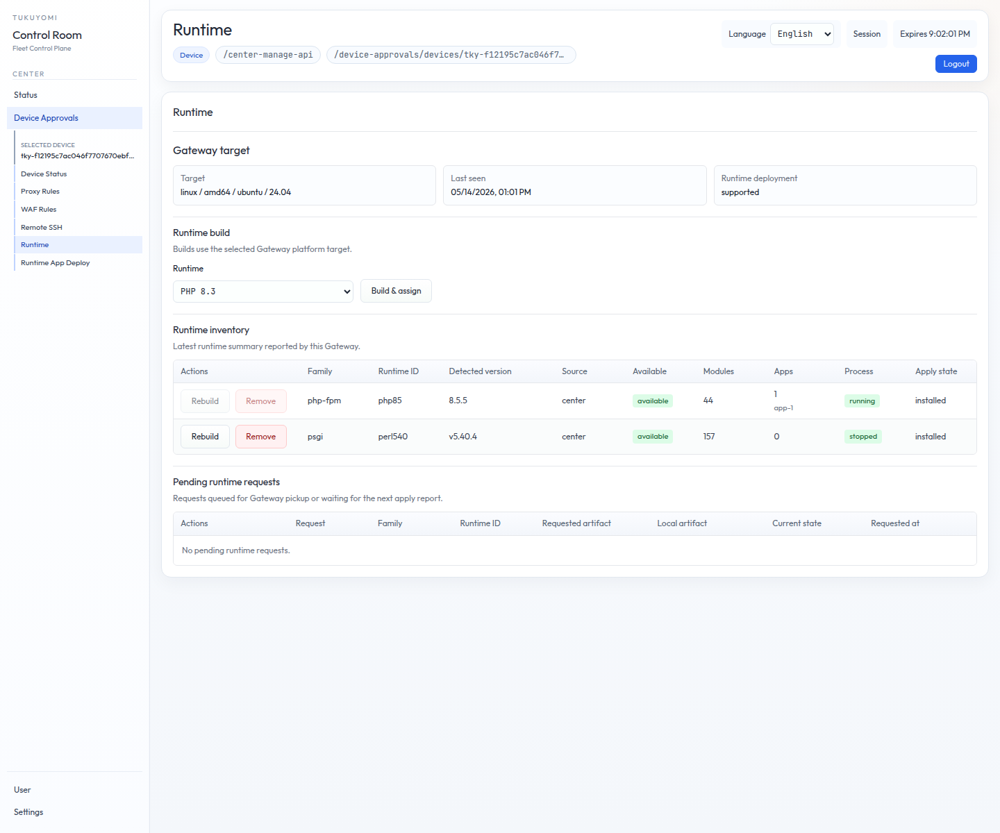

# Chapter 16. IoT / Edge device enrollment

The closing chapter of Part VI covers the optional **IoT / Edge device
enrollment (`device-auth-enrollment`)** feature. It is the workflow for
**registering a device identity from Tukuyomi Gateway with Tukuyomi
Center**, used by deployments that need edge / device controls.

## 16.1 When to enable this feature

A note up front:

> **You do not need to enable IoT / Edge mode on every Web / VPS
> deployment.**

Normal Web / VPS deployments can leave `IoT / Edge Mode` **OFF**.
Device authentication / Center approval covered here is the feature
for **wanting a device identity confirmed centrally per deployment** —

- An **edge gateway** that obtains its identity at install time at the
  field site after factory shipment.
- **Fleet management** of many **IoT devices** under central approval.

For the general use case of "WAF + reverse proxy in front of the web",
you can skip this chapter.



## 16.2 Roles

Three actors run the workflow:

- **Center**
  - **Issues** enrollment tokens.
  - **Approves or rejects** pending device enrollment requests.
- **Gateway**
  - Owns the **local device identity**, the **private key**, and the
    **enrollment request**.
- **Enrollment token**
  - A temporary registration secret.
  - The Gateway sends it to the Center **once** and does **not store
    it locally**.

In short, the Gateway owns "**who am I (identity)**", and the Center
decides "**do I trust this Gateway**".

## 16.3 Operator flow

The flow alternates between the Center and the Gateway. Do not
shuffle the order.



1. Open or start the Center.
2. Open `Device Approvals`.
3. Use **`Create enrollment token`** to generate an enrollment token.
4. **Copy the token immediately.** The Center does not show the full
   token again.
5. Open `Options` on the Gateway.
6. Enable **`IoT / Edge Mode`**.
7. Save the mode and **restart the Gateway** so the running process
   picks up `edge.enabled=true`.
8. Enter the **Center URL** and the **enrollment token** under
   `Center Enrollment`.
9. Leave `Device ID` **blank** unless you need a fixed ID.
10. Leave `Key ID` at **`default`** unless you intentionally manage
    multiple keys.
11. Run **`Request Center approval`**.
12. Return to `Device Approvals` on the Center.
13. **Approve or reject** the pending device.

After submission, the Gateway's status sits at **`pending`** until the
Center approves it.

### 16.3.1 The proxy is locked until approved

When `edge.enabled=true` and device approval is required, **the
Gateway's public proxy opens only when the local Center status is
`approved`**.

Specifically, in any of the following states, the proxy request path
**returns `503`**:

- `pending`
- `rejected`
- `revoked`
- `product_changed`
- `failed`
- unknown
- identity not configured

Normal Web / VPS deployments leave IoT / Edge mode OFF, so they **do
not hit this `503`**.

### 16.3.2 Status refresh after approval



After the Center approves the device, the Gateway refreshes the local
cached status by polling the Center. The default interval is 30 seconds.
For an immediate refresh, return to `Options > Center Enrollment` on
the Gateway and run **`Check Center status`**. The Gateway sends a
**signed status request** to the Center and updates the locally cached
device status.

This status path is also used for future **revocation** and **product
ID / token rotation**. The current authorization state is **owned by
the Center**, and after refresh the Gateway **locks the proxy** if the
status is anything other than `approved`.

### 16.3.3 Center-managed device views

After a device is registered, use **`Device Approvals > Registered
devices > Manage`** to enter the selected device menu. The left
navigation then shows device-specific pages under `Device Approvals`.



`Device Status` shows the approval state, last status check, platform
details reported by the Gateway, and the config snapshot history. The
snapshot table is the place to view or download the bounded, redacted
Gateway JSON payload.

This Center snapshot is not the same file as the Gateway Status
`Download config` export. The Status export is a seed/restore
`config-bundle.json` artifact; the Center snapshot is a signed
fleet-status payload with device identity, revision metadata, and
per-domain `etag`/`raw` entries.



`Runtime` uses the Gateway-reported platform target to match runtime
artifacts. Center can build a PHP-FPM or PSGI runtime artifact for that
target, store it as a compressed artifact, and assign it to the
Gateway. Existing compatible artifacts can also be assigned directly.

Runtime changes are not applied by the Center HTTP request itself.
They become **pending runtime requests**. The Gateway receives those
requests during the signed status polling path, validates the artifact
metadata and target, downloads the compressed artifact, and installs or
removes the runtime locally. A pending request can be canceled only
before the Gateway has picked it up. Removal is guarded twice: the
Center UI disables unsafe requests from the latest inventory, and the
Gateway checks Runtime App references and running processes again
before deleting local runtime files.

## 16.4 Preview URLs

To preserve Gateway settings and Center token / approval state across
restarts during a fleet preview, **persist both preview DBs**:

```bash
GATEWAY_PREVIEW_PERSIST=1 CENTER_PREVIEW_PERSIST=1 make fleet-preview-up
```

To preview the same topology as `INSTALL_ROLE=center-protected`, enable
Center protected preview:

```bash
CENTER_PROTECTED_PREVIEW=1 \
GATEWAY_PREVIEW_PERSIST=1 \
CENTER_PREVIEW_PERSIST=1 \
make fleet-preview-up
```

In that mode, Center still runs separately, while Gateway seeds `/center-ui`
and `/center-api` routes to Center over the shared Docker preview network.
Open Center through Gateway at `http://localhost:9090/center-ui`. Protected
preview also enables Gateway IoT / Edge mode and bootstraps the matching Center
approval against the preview Center DB.

When the Center process API path is private, keep
`CENTER_PREVIEW_GATEWAY_API_BASE_PATH` on the public Gateway path and set
`CENTER_PREVIEW_API_BASE_PATH` to the Center path. Gateway rewrites the public
route before forwarding to Center.

With `GATEWAY_PREVIEW_PERSIST=1`, these protected routes are seeded only when
the Gateway preview DB is created. If an existing persistent Gateway preview DB
is already present, reset that preview DB or add the routes from `Proxy Rules`.

If the Gateway is running inside a preview container, **do not point
the Center URL at `http://localhost:9092`**. Inside the Gateway
container, **`localhost` resolves to the Gateway itself**.

In preview, use a Center URL reachable from the host:

```text
http://host.docker.internal:9092
```

If your Docker runtime does not provide `host.docker.internal`,
**configure host-gateway mapping** on the preview / container side, or
specify a reachable Center address.

## 16.5 Center URL rules

The Center URL accepted by the Gateway has constraints:

- **HTTP or HTTPS** only.
- **No userinfo credentials.**
- The path must be empty, `/`, or `/v1/enroll`.
- The Gateway **normalizes the enrollment-request destination to
  `/v1/enroll`** on the Center.

Outside local previews and trusted test networks, **use HTTPS**.

## 16.6 Identity and fingerprint

If no local identity exists, the Gateway generates an **Ed25519 key
pair**:

- **Private key**: stored in the Gateway DB.
- **Public key**: sent to the Center in the enrollment request.

The `Public key fingerprint` format is:

```text
Ed25519 public key
 -> x509 PKIX DER
 -> SHA-256
 -> lowercase hex
```

That is, it is the **SHA-256 of the PKIX DER public-key bytes (lowercase
hex), not the raw 32-byte Ed25519**. Both sides compute the fingerprint
the same way so it can be confirmed at a glance.

## 16.7 Local-identity constraint

A Gateway currently owns **a single local device identity**. Once a
local identity exists, subsequent enrollment requests **must use the
same `Device ID` and `Key ID`**.

If a different value is supplied, the Gateway **rejects** the
enrollment request **rather than silently swapping the device private
key**. This is by design — to prevent an unnoticed key rotation.

## 16.8 Token handling

Operating policy for enrollment tokens:

- **Treat enrollment tokens as secrets.**
- For factory or rollout batches, prefer **short-lived or low-use-count**
  tokens.
- **Revoke tokens** once the rollout window is over.
- **The Gateway stores Center URL and local identity state, but does
  not store the enrollment token.**
- An enrollment token is **proof at registration time** only;
  **runtime authorization is judged from the Center device status the
  Gateway caches**.

In other words, the enrollment token is **a one-shot key for initial
registration**, and it is not used in ongoing authorization decisions.

## 16.9 Troubleshooting

Common errors and fixes seen in real deployments:

| Symptom | Cause and fix |
|---|---|
| `connect: connection refused` against `localhost:9092` | The Gateway is connecting to itself from inside the container. Use **`host.docker.internal:9092`** or another reachable Center address. |
| `edge device authentication is not enabled in the running process` | After saving `IoT / Edge Mode`, you have not **restarted the Gateway**. |
| `enrollment token is required` | The token created on the Center has not been pasted into **`Center Enrollment`** on the Gateway. |
| `invalid enrollment token` | The token is wrong, revoked, expired, has hit its use-count limit, or is for a different Center DB. |
| `local device identity already exists with a different device_id/key_id` | Use the existing local identity values, or **explicitly reset the local Gateway identity state**. |

For normal external Center enrollment, the supported operator entrypoint is
**`Options > Center Enrollment`** on the Gateway, or the admin API behind that
screen. `INSTALL_ROLE=center-protected` and `CENTER_PROTECTED_PREVIEW=1` are the
local same-owner exceptions: they bootstrap Gateway identity and Center approval
without an enrollment token.

## 16.10 Recap

- Normal Web / VPS deployments leave **IoT / Edge mode OFF**.
- Enrollment is a three-step pattern: **Center issues a token →
  Gateway requests approval → Center approves**.
- When `edge.enabled=true` and the device is unapproved, the
  Gateway's **public proxy returns `503`**.
- The Gateway generates an **Ed25519 key pair** locally. The
  fingerprint is **PKIX DER → SHA-256 → lowercase hex**.
- An enrollment token is **registration-time proof only**; runtime
  authorization comes from the Center-derived device status.

## 16.11 Bridge to the next chapter

Part VI ends here. Part VII — "Performance and regression" — covers
the **benchmarking and regression frameworks** tukuyomi ships with.
Chapter 17 walks through the roles of `make bench-proxy` /
`make bench-waf` / `make smoke`, the assurance matrix,
release-binary smoke, and the recommended confidence ladder.
