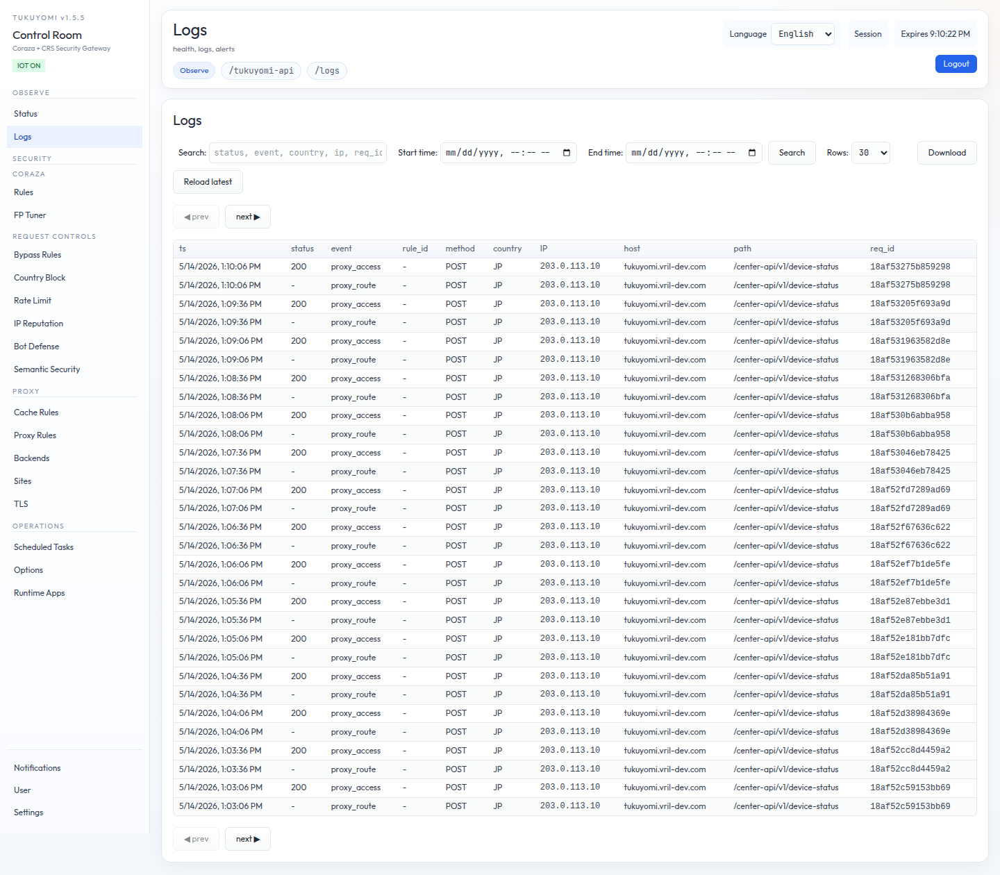
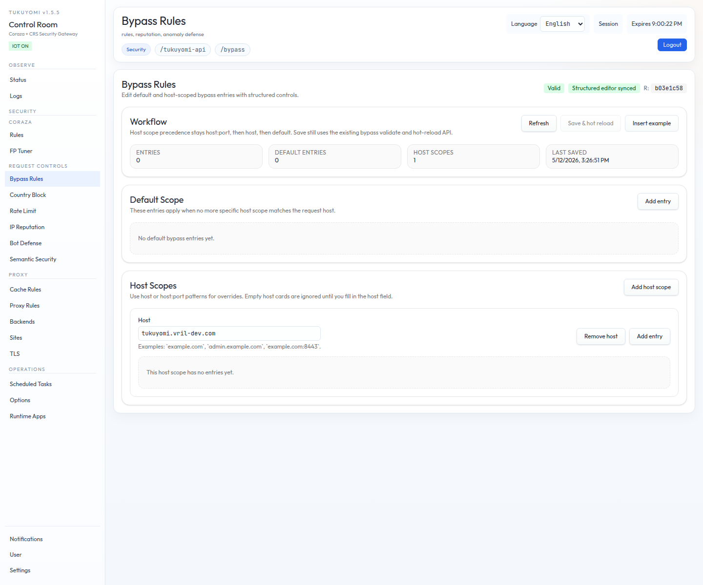

# 第7章　WAF 誤検知チューニング

WAF を本番運用に投入したときに、最初に直面するのが **誤検知（False Positive）
への対処** です。Coraza + OWASP CRS は強力ですが、業務アプリケーション固有の
クエリやパラメータは、攻撃パターンに似た形をしていることがしばしばあります。

本章では、tukuyomi + Coraza + CRS という構成で、誤検知を **安全に、狭く、
追跡可能な形で** 減らしていくための実運用手順を扱います。AI 連携による FP
Tuner は次の第8章で扱うので、本章は **operator が手で進めるときの基本動作**
を整理する位置づけです。



## 7.1　チューニングの基本姿勢

最初に方針だけ確認しておきます。

- **証跡を取ってから動く**: ブロックされた request と一致する `req_id`、
  発火した rule、対象 path、client 情報を必ず記録する。
- **影響範囲を切り分ける**: そのブロックは「この 1 endpoint だけ」「この
  parameter だけ」「この method だけ」のいずれに限定されるかを言語化する。
- **緩和は最小限の単位で**: 広い bypass を最初の手段にしない。`extra_rule`
  による per-path snippet が最初の選択肢。
- **変更は検証して残す**: 再現 request を CI に乗せ、攻撃 payload が依然
  ブロックされることも確認する。
- **一時回避は期限を切る**: 期限付きで入れて、必ず Issue 化して戻す。

これら 5 つを満たさない緩和は、いずれ **誰も理由を覚えていない緩い穴** に
育ちます。tukuyomi の WAF tuning フローは、この 5 つを順序立てて踏める
ように構成されています。

## 7.2　ステップ 1: まず証跡を取る

### 7.2.1　ログから rule_id と path を確認する

管理 API でログを取得し、対象の `rule_id` と `path` を確認します。Logs 画面
で見える内容と同じデータを、API でも引けます。

`/tukuyomi-api/logs/read?src=waf&req_id=<id>` を使えば、同じ `req_id` に
対する WAF event を絞って読めます。client IP、UA、query を 1 件に narrow
していきます。

### 7.2.2　再現可能な HTTP request を残す

口頭やチケットの転記だけで「だいたいこういう request」を扱うと、後段の
緩和の効果検証が崩れます。`curl`、E2E スクリプト、テストフィクスチャの
いずれかで、**再現可能な HTTP request** を必ず残してください。後の検証
（7.6 節）の入力になります。

## 7.3　ステップ 2: 影響範囲を切り分ける

集めた証跡から、次の問いに答えていきます。

1. その block は **単一 endpoint** だけで発生しているか
2. **特定の parameter / method / Content-Type** に限定されるか
3. 本当に **攻撃 pattern ではない** と判断できる根拠は何か（仕様書、画面、
   backend 実装、社内 ticket）

最後の根拠は、緩和を入れる側の責任範囲を決める材料になります。「これは仕様
として正しい query で、安全である」という言葉を、自分以外の誰かが後から
読んでも納得できるように残しておきます。

## 7.4　ステップ 3: 緩和は狭く行う

緩和の選択肢には次の 3 段階があります。**上から順に、より狭い緩和** です。
**極力上から選んで** ください。

1. **`Bypass Rules` で対象 path だけに `extra_rule` を指定する**
2. **`Rules > Advanced > Bypass snippets` で専用 `*.conf` asset を用意し、
   対象 rule を `ctl:ruleRemoveById` で限定的に無効化する**
3. **最終手段として、広い path の bypass を使う**（必ず期限付きで実施し、
   後で戻す）

それぞれを順に見ます。



### 7.4.1　`extra_rule` による per-path tuning

`Bypass Rules` の JSON 構造は次のようになっています。

```json
{
  "default": {
    "entries": []
  },
  "hosts": {
    "example.com": {
      "entries": [
        { "path": "/search", "extra_rule": "orders-preview.conf" }
      ]
    }
  }
}
```

host scope の優先順は次のとおりです。

1. exact `host:port`
2. bare `host`
3. `default`

ここで重要なのは、**host-specific scope は default を merge せず、丸ごと
置き換える** という点です。`hosts."example.com"` を書いた瞬間、その host に
対しては `default.entries` は適用されません。両方適用したい場合は、host
scope の側にも entry を再掲する必要があります。

`extra_rule` は **Coraza-backed のチューニング用 hook** です。`Rules` 画面で
管理する `orders-preview.conf` のような snippet を、対象 path だけに当てます。

```conf
SecRuleEngine On

SecRule ARGS:q "@rx (?i)(<script|union([[:space:]]+all)?[[:space:]]+select|benchmark\s*\(|sleep\s*\()" \
  "id:100001,phase:2,deny,status:403,log,msg:'suspicious search query'"
```

これは `ARGS:q` に対して、より狭くチューニングした deny rule を当てる例です。
**自前の deny rule を、その path にだけ追加で評価する** という形で、CRS の
広い rule set と独立した tune を入れられます。

なお、active な WAF engine が Coraza ではない場合（将来 ModSecurity adapter
等が入った場合）、`extra_rule` の Coraza snippet はそのままでは適用できません。
その場合は full bypass entry か engine-native tuning を使います。

### 7.4.2　`ctl:ruleRemoveById` で限定無効化

`extra_rule` 側で snippet を組むより、**特定の CRS rule id を狭い scope で
だけ無効にする** ほうが素直なケースもあります。`Rules > Advanced > Bypass
snippets` に、対象 rule を `ctl:ruleRemoveById` で外す `*.conf` を用意します。

```conf
SecRule REQUEST_URI "@beginsWith /api/legacy/"
  "id:200001,phase:1,pass,nolog,ctl:ruleRemoveById=942100"
```

`ctl:ruleRemoveById` は、その request だけ rule を外す動作です。`@beginsWith`
で path を絞り、対象 rule を 1 件だけ外す形にすれば、全体の感度は変えずに
当該 path だけ通せます。

### 7.4.3　最終手段としての広い bypass

どうしても上の 2 種類で対応できない場合のみ、広い path の bypass を使います。
このときは必ず次を行います。

- **期限を切る**（30 日 / 60 日など、根拠とともに）
- **Issue を発行する**（期限到来時に外す責務を明示する）
- **PR の説明に外す条件を書く**（「`/legacy/foo` が deprecate されたら撤去」など）

緩い穴を入れたまま忘れることのないよう、運用フロー全体で期限管理を回します。

## 7.5　ステップ 4: CRS 設定の見直し

個別の path だけでなく、**CRS 全体の感度** を見直すべき場面もあります。
そのときに触る場所は次のとおりです。

1. **`rules/crs/crs-setup.conf` から import された DB-backed CRS setup
   asset の Paranoia Level を確認する**
2. 初期導入時は **`PL1` から開始** し、段階的に上げる
3. **anomaly threshold を下げ過ぎていないか** 確認する

Paranoia Level（PL）は、CRS の感度を 4 段階で切り替えるスイッチです。PL を
上げるほど検知は強くなりますが、誤検知率も上がります。本番投入時の安全な
出発点は PL1 で、運用が安定してきたら段階的に PL2 へ、という進め方が標準
です。

anomaly threshold は、CRS の score 累積に対して block する閾値です。低く
しすぎると、わずかな違和感でも block するようになり、誤検知の温床になります。

## 7.6　ステップ 5: 変更の検証

緩和を入れたあとは、その緩和が **本当に意図どおりに動いているか** を
2 方向で検証します。

### 7.6.1　誤検知の再現が止まることを確認する

7.2 節で残した再現 request を、CI / 自動テストに加えます。本番では緩和済み
の request が `200` で通るのを期待しますが、CI 上では「**この request が
WAF で block されないこと**」をアサーションするテストを置いておきます。
これがあれば、後日 CRS のバージョンを上げたときに、その緩和が効きを失った
場合にすぐ気づけます。

### 7.6.2　攻撃ペイロードが依然ブロックされることを確認する

緩和が広がりすぎていないかを確認します。代表的な XSS / SQLi の payload を
同じ path に投げて、`403` などの WAF block で止まることを確認します。

### 7.6.3　24 時間のログ監視

本番反映後 24 時間は、

- 過検知が減ったか
- 逆に **見逃しが増えていないか**

の両方を Logs / Notifications 画面で監視します。

## 7.7　ステップ 6: 変更管理

最後に、緩和そのものを **後から追跡できる形** に残します。

1. チューニング内容は **PR レビュー** を通す
2. PR 説明に次を必ず書く
   - 変更理由（誤検知の根拠、仕様、画面）
   - 対象 path
   - 対象 Rule ID
   - 有効期限（一時回避の場合）
3. 一時回避を入れた場合は、**削除期限を Issue 化** する

これらは「人が増えても忘れない仕組み」を作る最低ラインです。tukuyomi の
管理 UI は変更を DB に保存しますが、**運用判断の文脈** は git の PR 履歴と
issue tracker にだけ残ります。

## 7.8　ここまでの整理


- 誤検知への対処は、**証跡 → 影響範囲 → 狭い緩和 → CRS 再点検 → 検証 →
  変更管理** の 6 ステップで進める。
- 緩和の優先順は、**`extra_rule` による per-path snippet → `ctl:ruleRemoveById`
  による rule 限定外し → 広い bypass（期限付き）** の順に弱くなる。
- `Bypass Rules` の host scope は default を merge **しない**。
- 緩和が攻撃を素通りさせていないことの確認まで含めて 1 セット。
- 一時回避は期限を切り、Issue で追跡する。

## 7.9　次章への橋渡し

本章は operator が **手で** 誤検知を tune する流れでした。tukuyomi では、
これに加えて **AI による誤検知削減アシスト** として **FP Tuner** を提供
しています。次章では、FP Tuner の API contract、Propose / Apply の挙動、
OpenAI / Claude Messages 対応の Command Provider を扱います。
