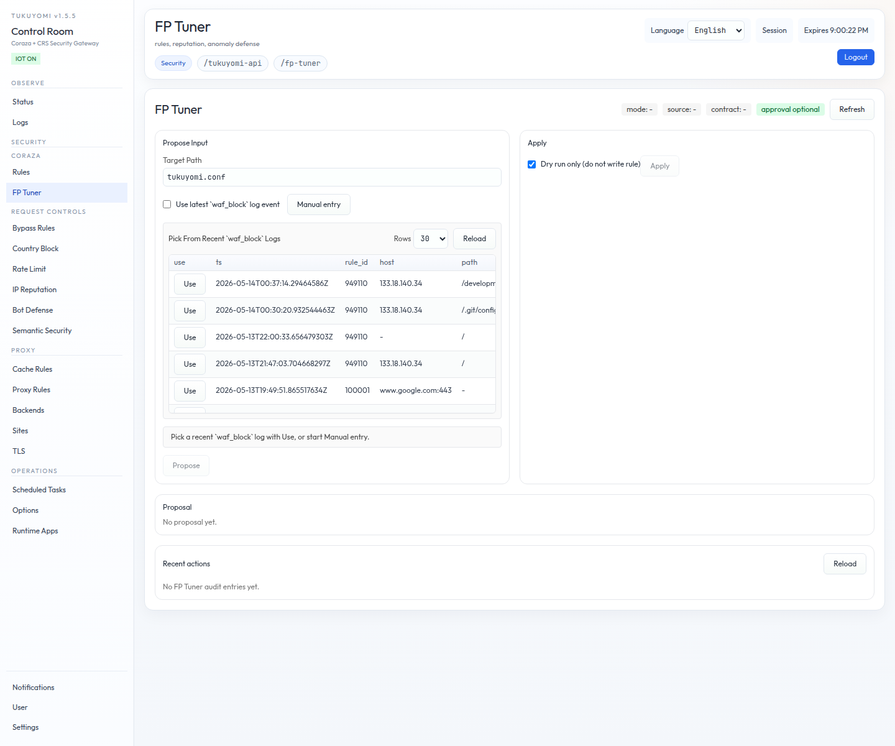

# 第8章　FP Tuner API と AI 連携

第7章では operator が **手で** WAF 誤検知を tune するフローを扱いました。
本章では、tukuyomi が提供する **FP Tuner（False-Positive Tuner）** を扱います。
FP Tuner は、観測された WAF block event に対して、**安全に scope された
Coraza exclusion rule** を AI provider に提案させ、operator の承認のもとで
適用する仕組みです。



本章で扱うのは v1 の API contract です。HTTP provider 経由の Coraza
false-positive exclusion tuning flow について、Propose と Apply の 2 つの
endpoint、approval token、audit、関連 env、OpenAI / Claude Messages 互換の
command provider までをまとめます。

## 8.1　なぜ FP Tuner が要るのか

第7章のフローを真面目に踏むと、誤検知 1 件あたりに **証跡採取・影響範囲の
切り分け・狭い rule の起案・検証** という相応の手間がかかります。誤検知の
ほとんどは、見ればわかる「特定 host・特定 path・特定 parameter で発火する、
特定 rule_id」の組み合わせなのに、**毎回ゼロから rule を書くのは割に合わない**
という現実があります。

FP Tuner は、

- 観測された block event を入力として渡す
- AI provider に **scoped exclusion rule の draft** を作らせる
- operator が **承認** したうえで、`tukuyomi.conf` に apply する

という 3 ステップに圧縮します。AI が単独で rule を書き換えることはなく、
**承認なしの apply は本番反映できない** のが基本契約です。

## 8.2　Endpoints

FP Tuner v1 が提供するのは、次の 2 つの endpoint です。

- `POST /tukuyomi-api/fp-tuner/propose`
- `POST /tukuyomi-api/fp-tuner/apply`

`propose` は AI provider に proposal を作らせる、`apply` はそれを実環境に
適用する、という分担です。

## 8.3　Propose

### 8.3.1　Request

```json
{
  "target_path": "tukuyomi.conf",
  "event": {
    "event_id": "manual-test-001",
    "method": "GET",
    "scheme": "https",
    "host": "search.example.com",
    "path": "/search",
    "query": "q=select+*+from+users",
    "rule_id": 100004,
    "status": 403,
    "matched_variable": "ARGS:q",
    "matched_value": "select * from users"
  }
}
```

注意点:

- `event` は **optional** です。省略した場合、server は DB `waf_events`
  から最新の `waf_block` event を探します。
- **unknown field は reject** されます。
- provider は、安全な scoped Coraza exclusion proposal を **1 件**、または
  明示的な `no_proposal` を返す前提で動きます。

### 8.3.2　Response（proposal あり）

```json
{
  "ok": true,
  "contract_version": "fp_tuner.v1",
  "mode": "http",
  "source": "request",
  "approval": {
    "required": true,
    "token": "6f9d...token..."
  },
  "input": {
    "event_id": "manual-test-001",
    "method": "GET",
    "scheme": "https",
    "host": "search.example.com",
    "path": "/search",
    "query": "q=select+*+from+users",
    "rule_id": 100004,
    "status": 403,
    "matched_variable": "ARGS:q",
    "matched_value": "select * from users"
  },
  "proposal": {
    "id": "fp-http-001",
    "title": "Scoped false-positive tuning suggestion",
    "summary": "Scoped false-positive tuning suggestion.",
    "reason": "HTTP FP tuner flow の provider-generated response.",
    "confidence": 0.84,
    "target_path": "tukuyomi.conf",
    "rule_line": "SecRule REQUEST_HEADERS:Host \"@rx ^search\\.example\\.com(:443)?$\" \"id:190123,phase:1,pass,nolog,chain,msg:'tukuyomi fp_tuner scoped exclusion'\"\nSecRule REQUEST_URI \"@beginsWith /search\" \"ctl:ruleRemoveTargetById=100004;ARGS:q\""
  }
}
```

ポイントは次のとおりです。

- `approval.required=true` の場合、**simulate しない apply には
  `approval_token` が必要** です。
- `proposal.rule_line` は `SecRule` の chain です。host を narrow に
  match させ、`@beginsWith /search` で path を絞り、`ctl:ruleRemoveTargetById`
  で **対象 rule の対象 variable だけ** を外しています。
- `confidence` は provider が返す主観 score です。これだけで自動 apply は
  しません（承認の根拠の 1 つ）。

### 8.3.3　Response（`no_proposal`）

provider が「安全な exclusion を正当化する根拠が無い」と判断した場合は、
proposal を返さず、`no_proposal` を返します。

```json
{
  "ok": true,
  "contract_version": "fp_tuner.v1",
  "mode": "http",
  "source": "request",
  "approval": { "required": false },
  "input": { /* 上と同じ */ },
  "no_proposal": {
    "decision": "no_proposal",
    "reason": "この event には安全な Coraza scoped exclusion を正当化する根拠が不足しています。",
    "confidence": 0.12
  }
}
```

これは「block は妥当である」「事実上の攻撃 pattern かもしれない」「scope が
切れない」といった場合に返ります。**FP Tuner は無理に exclusion を作ら
ない**、というのが安全側の基本動作です。

## 8.4　Apply

### 8.4.1　Request

```json
{
  "proposal": {
    "id": "fp-http-001",
    "target_path": "tukuyomi.conf",
    "rule_line": "SecRule REQUEST_HEADERS:Host \"@rx ^search\\.example\\.com(:443)?$\" \"id:190123,phase:1,pass,nolog,chain,msg:'tukuyomi fp_tuner scoped exclusion'\"\nSecRule REQUEST_URI \"@beginsWith /search\" \"ctl:ruleRemoveTargetById=100004;ARGS:q\""
  },
  "simulate": true,
  "approval_token": "6f9d...token..."
}
```

注意点:

- **`simulate` の default は `true`** です。明示的に `false` にしない限り、
  本番反映はされません。
- `rule_line` は **strict な allow-list pattern** で validation されます。
  許容されるのは scoped exclusion 形式のみです。任意の `SecRule` を流し込む
  ような使い方はできません。
- `WAF_FP_TUNER_REQUIRE_APPROVAL=true` かつ `simulate=false` の場合は、
  **`approval_token` が必須** です。

### 8.4.2　Response（simulate）

```json
{
  "ok": true,
  "contract_version": "fp_tuner.v1",
  "simulated": true,
  "hot_reloaded": false,
  "reloaded_file": "tukuyomi.conf",
  "preview_etag": "W/\"sha256:...\""
}
```

simulate では実 file は書き換えられません。`preview_etag` は、その diff が
何に対するものかを区別するための弱 etag です。

### 8.4.3　Response（real apply）

```json
{
  "ok": true,
  "contract_version": "fp_tuner.v1",
  "etag": "W/\"sha256:...\"",
  "hot_reloaded": true,
  "reloaded_file": "tukuyomi.conf"
}
```

`hot_reloaded=true` は、`tukuyomi.conf` 側の rule asset が hot reload された
ことを表します。

## 8.5　Security Behavior

FP Tuner の安全側の挙動は次のとおりです。

- **provider に渡す request payload は、外部送信前に sanitize される**。
- provider には、Coraza / ModSecurity-compatible な **host-aware scoped
  exclusion** だけを考えるように明示する。
- credible な false positive でないと判断した場合、または根拠不足の場合、
  provider は **`no_proposal` を返す前提**。
- 安全な proposal scope は、observed の `scheme + host[:default-port] +
  path + rule_id + matched_variable` に bind する。
- `http:80` / `https:443` のとき、host scope は `^example\.com(:80)?$` /
  `^example\.com(:443)?$` のような **narrow な optional-default-port regex**
  を使うことがある。
- mask 対象には次が含まれる: bearer / JWT-like token、email、IPv4、common
  secret query key。
- **apply で受け付けるのは scoped exclusion format だけ**。任意の rule
  insertion はできない。
- propose / apply の action は、**`WAF_FP_TUNER_AUDIT_FILE`**（default
  `audit/fp-tuner-audit.ndjson`）へ追記される。
- audit path は runtime UID / GID（`PUID` / `GUID`）で書き込めるよう設定
  すること。

## 8.6　Related Env Vars

FP Tuner の主な環境変数は次の 3 つです。

| 変数 | default | 用途 |
|---|---|---|
| `WAF_FP_TUNER_REQUIRE_APPROVAL` | `true` | apply に approval token を必須にするか |
| `WAF_FP_TUNER_APPROVAL_TTL_SEC` | `600` | approval token の有効期間（秒） |
| `WAF_FP_TUNER_AUDIT_FILE` | `audit/fp-tuner-audit.ndjson` | audit 出力先 |

approval token を切ると、operator が承認なしで apply を投げられます。本番
運用では **`true` のまま運用するのが安全側既定** です。

## 8.7　Local HTTP Mode の Contract Test

HTTP provider 経由の propose / apply フロー、provider request の masking
動作、local stub provider に対する response contract handling を、リポジトリ
同梱のスクリプトで検証できます。

```bash
scripts/test_fp_tuner_http.sh
```

CI に組み込んで、provider 周りの contract が崩れていないかを継続的に確認
すると安心です。

## 8.8　Command Bridge Test

HTTP provider に加えて、**command-based provider** との連携も検証できます。
これは「shell command を 1 本起動して、stdin に request を渡し、stdout で
response を受け取る」という最小契約です。

```bash
scripts/test_fp_tuner_bridge_command.sh
```

主な構成要素:

- Bridge server: `scripts/fp_tuner_provider_bridge.py`
- Example command provider: `scripts/fp_tuner_provider_cmd_example.sh`
- `BRIDGE_COMMAND=/path/to/cmd.sh` で provider command を override できる

これにより、自社で持っている任意の AI / heuristic 判定 system を、
FP Tuner の provider として差し込めます。

### 8.8.1　OpenAI 互換の Command Provider

OpenAI 互換 API（OpenAI、Azure OpenAI、互換 endpoint を提供する各種 LLM
ゲートウェイ）を呼ぶ provider が同梱されています。

- Script: `scripts/fp_tuner_provider_openai.sh`
- Required env:
  - `FP_TUNER_OPENAI_API_KEY`（または `OPENAI_API_KEY`）
  - `FP_TUNER_OPENAI_MODEL`（または `OPENAI_MODEL`、または provider request
    の `model`）
- Optional env:
  - `FP_TUNER_OPENAI_API_TYPE`（default `responses`、または `chat`）
  - `FP_TUNER_OPENAI_BASE_URL`（default `https://api.openai.com/v1`）
  - `FP_TUNER_OPENAI_ENDPOINT`（full endpoint URL を override）
  - `FP_TUNER_OPENAI_TIMEOUT_SEC`（default `30`）

local mock validation:

```bash
scripts/test_fp_tuner_openai_command.sh
```

### 8.8.2　Claude Messages の Command Provider

Anthropic Claude Messages API を呼ぶ provider も同梱されています。

- Script: `scripts/fp_tuner_provider_claude.sh`
- Required env:
  - `FP_TUNER_CLAUDE_API_KEY`（または `ANTHROPIC_API_KEY`）
  - `FP_TUNER_CLAUDE_MODEL`（または `ANTHROPIC_MODEL`、または provider
    request の `model`）
- Optional env:
  - `FP_TUNER_CLAUDE_BASE_URL`（default `https://api.anthropic.com`）
  - `FP_TUNER_CLAUDE_ENDPOINT`（full endpoint URL を override。default
    `/v1/messages`）
  - `FP_TUNER_CLAUDE_API_VERSION`（default `2023-06-01`）
  - `FP_TUNER_CLAUDE_BETA`（optional な `anthropic-beta` header value）
  - `FP_TUNER_CLAUDE_TIMEOUT_SEC`（default `30`）
  - `FP_TUNER_CLAUDE_MAX_TOKENS`（default `700`）

local mock validation:

```bash
scripts/test_fp_tuner_claude_command.sh
```

OpenAI / Claude のどちらの場合も、provider が出力する `proposal.rule_line`
は、5 章までの safety contract（scoped exclusion 形式 / strict allow-list /
approval token）に従います。**FP Tuner の安全境界は provider 種別に関係なく
同じ** という点が、本章で押さえておきたい設計ポイントです。

## 8.9　ここまでの整理

- FP Tuner は **AI が誤検知の exclusion 案を作り、operator が承認して
  apply する** 仕組み。
- propose / apply の 2 endpoint は **strict allow-list / approval token /
  audit ログ** で守る。
- provider は OpenAI / Claude などの command provider 形式で差し替えられる。
- 安全側 default は `simulate=true` と `WAF_FP_TUNER_REQUIRE_APPROVAL=true`。

## 8.10　次章への橋渡し

第7章・第8章で扱ったのは、Coraza WAF の検査結果に対する後処理（誤検知への
緩和）でした。次の第9章では、tukuyomi が **WAF とは別軸で持っている
request-time の security plugin model** ── plugin の interface、
`SecurityEvent` 契約、ordering、registration、最小実装例 ── を扱います。
