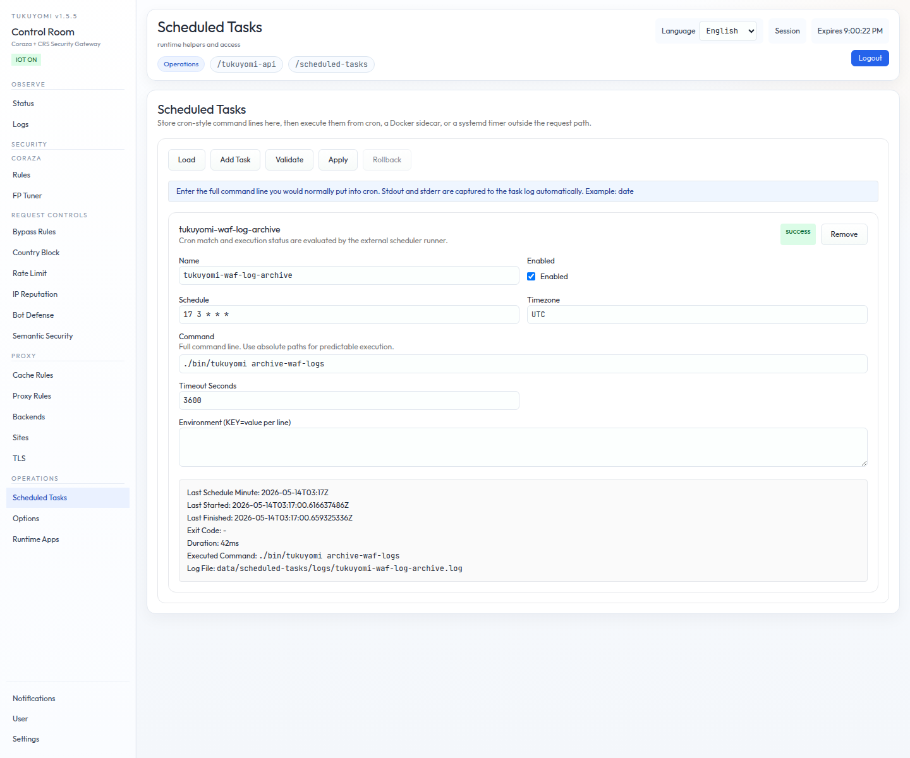

# 第12章　Scheduled Tasks

第V部最後の章では、tukuyomi の **Scheduled Tasks** を扱います。これは、
管理 UI で定義しつつ、**request path の外で実行する command-line job** を
管理する仕組みです。Laravel の `artisan schedule:run`、Movable Type の
背景処理、GeoIP DB 自動更新、独自の集計バッチなどが想定用途です。



## 12.1　責務分離 ── 「定義」と「起動」を分ける

Scheduled Tasks の最初の整理ポイントは、**task の定義** と **実際の minute
単位での起動** が、はっきり別の場所にある、ということです。

- **`/scheduled-tasks`**
  - task 定義の **source of truth**
  - cron schedule、command line、env、timeout、最終実行状態の管理
- **外部 scheduler**
  - **`tukuyomi run-scheduled-tasks`** を起動
  - 実際の minute 単位の起動を担当
  - main HTTP server process とは **分離**

つまり、tukuyomi 本体は cron daemon を持ちません。**platform 側の scheduler
（systemd timer / sidecar / 専用 scheduler container）** が `tukuyomi
run-scheduled-tasks` を起動し、main の HTTP server とは別の process として
動かす ── これが基本形です。

## 12.2　Data Layout

保存される task 定義の正は、normalized `scheduled_tasks` DB domain です。
`conf/scheduled-tasks.json` は **空 DB の seed / export file** であり、
bootstrap 後の runtime source of truth ではありません。第3章でも繰り返し
出てきた「DB が runtime authority、JSON は seed / import / export」の
ルールが、ここでも貫かれています。

最終実行状態は、`scheduled_task_runtime_state` DB table に記録されます。
生成される runtime artifact は、`data/scheduled-tasks/` 配下に置かれます。

- `locks/`: task ごとの lock file
- `logs/`: task ごとの log

既定 path は effective DB `app_config` の default で制御します。

- `paths.scheduled_task_config_file`

## 12.3　Task Model

各 task は、cron 風の **full command line を 1 本** 持ちます。

```text
date
```

stdout / stderr は **自動的に `data/scheduled-tasks/logs/` へ保存** されます。
ファイル名や rotate を operator が指定する必要はありません。

この形に絞ったことで、scheduled task のモデルは意図的に単純になっています。

- bundled runtime selector は持たない
- PHP binary 専用 field は持たない
- Working Directory は持たない
- args array も持たない

bundled PHP runtime を使いたければ、その `php` wrapper を **command line に
直接書きます**。host-installed PHP を使いたければ `/usr/bin/php8.5` などを
直接書きます。「runtime を選ばせる UI フィールド」は意図的に作っていない、
というのが設計の方針です。

## 12.4　UI Workflow

典型的な flow は次のとおりです。

1. `/scheduled-tasks` を開く
2. task を追加する
3. `name`、`schedule`、full `command` を入れる
4. 必要なら `env` と `timeout` を入れる
5. **`Validate`** を実行する
6. **`Apply`** を実行する

補足:

- 実行のぶれを避けるため、path は **absolute path を推奨** します。
- status は **外部 scheduler が one-shot runner を起動したとき** に更新
  されます（UI から手動で打鍵すると更新される、という挙動ではない点に注意）。
- UI に出る log path は `data/scheduled-tasks/logs/` 配下です。

## 12.5　Runner Command

外部 scheduler から実行する command はこれだけです。

```bash
./bin/tukuyomi run-scheduled-tasks
```

この command は次を行います。

- `conf/config.json` を読み込む
- 設定された DB store を開く
- normalized `scheduled_tasks` DB domain を **直接読む**。domain が無い時
  だけ `conf/scheduled-tasks.json` から seed する
- **現在 minute に一致する job だけ** を実行する
- 各 task を **`/bin/sh -lc`** で起動する
- task status を `scheduled_task_runtime_state` に記録する
- lock / log artifact を `data/scheduled-tasks/` に記録する

繰り返しになりますが、tukuyomi 自体は **cron daemon を持ちません**。
platform 側の scheduler から起動してください。

## 12.6　Binary Deployment Pattern

Linux の binary deployment では、**systemd timer** を使うのが標準パターン
です。

サンプルユニット:

- `docs/build/tukuyomi-scheduled-tasks.service.example`
- `docs/build/tukuyomi-scheduled-tasks.timer.example`

timer が **毎分起動**し、service 側で前節の one-shot command を実行する、
という形になります。第3章 3.11 節の登録例で、すでに `enable --now
tukuyomi-scheduled-tasks.timer` を含めているのは、この timer を立ち上げる
ためです。

## 12.7　Container Deployment Pattern

container deployment では、ownership を 2 つの形態に分けます。

### 12.7.1　現行 official default: single-instance sidecar

proxy 全体が official な single-instance mutable topology のままなら、
**scheduler sidecar** を使います（第4章 4.2 節の official topology と一致
する形）。

必要条件:

- main `tukuyomi` container と同じ `conf/` と `data/scheduled-tasks/` を
  mount する
- command line が `data/php-fpm/` 配下の bundled PHP path を指すなら、
  `data/php-fpm/` も mount する
- 同じ binary を `run-scheduled-tasks` 付きで起動する

repository の compose 導線では、proxy-owned command 向けに実体のある
sidecar service を使えます。

```bash
make compose-up-scheduled-tasks
```

生の compose command はこれです。

```bash
PUID="$(id -u)" GUID="$(id -g)" docker compose --profile scheduled-tasks up -d --build coraza scheduled-task-runner
```

`artisan schedule:run` のような **application job** は、application tree を
`coraza` と `scheduled-task-runner` の両方に mount する必要があります。
deployment 専用の override file として
`docs/build/docker-compose.scheduled-tasks.app.example.yml` を使ってください。

現在の sidecar 実行モデルは **明示的** です。shell loop が image 内の
proxy バイナリを `run-scheduled-tasks` 付きで呼び、次の minute 境界まで
sleep します。

failure policy も **明示的** です。`run-scheduled-tasks` が non-zero を
返したら、**sidecar も non-zero で終了** し、fault を握り潰さずに container
restart policy に渡します。

request を捌く main proxy container に `crond` を同居させるより、
**scheduler を分離するほうを推奨** します。`make gateway-preview-up` でも
preview 専用の scheduler sidecar が起動します。恒久的な scheduler fault は、
**sidecar logs と restart 回数** で追ってください。

### 12.7.2　将来の guarded shape: replicated frontend + dedicated singleton scheduler

現行の official single-instance topology を外れて、replicated immutable
frontend を試す場合は、**各 frontend replica に scheduler sidecar を 1 個
ずつ載せません**。

- frontend replica では **`admin.read_only=true`**
- config 変更は **rollout 経由**
- 各 frontend replica に scheduler sidecar を 1 個ずつ載せない
- scheduled-task ownership は **dedicated singleton scheduler role** に
  持たせる

その singleton scheduler role も、同じ source of truth として次を mount
します。

- `conf/`
- `data/scheduled-tasks/`
- `logs/`
- bundled runtime を使うなら `data/php-fpm/`

参照する artifact:

- `docs/build/ecs-replicated-frontend-scheduler.task-definition.example.json`
- `docs/build/kubernetes-replicated-frontend-scheduler.example.yaml`
- `docs/build/azure-container-apps-scheduler-singleton.example.yaml`

これは distributed mutable runtime support ではなく、**frontend を複製する
ときに scheduler ownership を明示的に切り出す** ためのパターンです。

## 12.8　Preview Manual Check

scheduler を含めた preview 経路を確認したいときは、第2章でも触れた preview
コマンドをそのまま使えます。

```bash
make gateway-preview-up
make gateway-preview-down
```

preview は **通常系とは別の preview 専用 DB-backed scheduled-task config**
を使うため、preview UI からの変更は通常の runtime config を汚しません。

既定では `gateway-preview-up` のたびに preview 専用 SQLite DB を作り直し、
以前の preview task や DB row は引き継ぎません。

`down/up` をまたいで preview 編集結果を残したいときは、preview 用 DB state
を保持します。

```bash
GATEWAY_PREVIEW_PERSIST=1 make gateway-preview-up
GATEWAY_PREVIEW_PERSIST=1 make gateway-preview-down
```

`GATEWAY_PREVIEW_PERSIST=1` では preview SQLite DB を保持するので、
`Settings` で保存した listener 変更を preview の `down/up` で確認できます。

split preview listener も使えますが、preview listener 設定の bind は
`:80` / `:9090` のような **host 到達可能な形** にしてください。
`localhost:80` / `127.0.0.1:80` / `[::1]:9090` のような **loopback bind は
Docker publish と噛み合わない** ため、`gateway-preview-up` は明示エラーで
止めます。

binary、Docker sidecar、preview sidecar の 3 経路をまとめて回す回帰確認は
次のコマンドです。

```bash
make scheduled-tasks-smoke
```

preview persistence と split-port parity だけを個別に回すなら次のコマンド
です。

```bash
make gateway-preview-smoke
```

## 12.9　Bundled PHP CLI

`make php-fpm-build` は、次の **両方** を生成します。

- `data/php-fpm/binaries/<runtime_id>/php-fpm`
- `data/php-fpm/binaries/<runtime_id>/php`

つまり、build 済み runtime bundle は **PHP-FPM workload と scheduled PHP CLI
job の両方** に使えます。scheduled task では `/options` を経由せず、その
CLI path を command line に直接書きます。

同梱 PHP CLI は、同梱 PHP-FPM runtime と同じ extension set を使うので、
**SQLite / MySQL(MariaDB) / PostgreSQL を標準で扱える** という点も大きな
メリットです。

## 12.10　GeoIP Country DB 自動更新

managed な country DB の更新は、**手動実行と scheduled automation の両方**
に対応します。

binary / repository の wrapper:

```bash
./scripts/update_country_db.sh
```

binary subcommand:

```bash
./bin/tukuyomi update-country-db
```

container image の command:

```bash
/app/server update-country-db
```

operator flow:

1. **`Options → GeoIP Update`** から `GeoIP.conf` を upload（DB mode では
   runtime DB authority に保存されます）
2. **`Update now`** を 1 回実行して成功を確認
3. deployment 形態に応じて、上記いずれかの command を呼ぶ **scheduled task
   を追加**

これにより、country DB の更新を operator が忘れない運用にできます。

## 12.11　ここまでの整理

- **task 定義は `/scheduled-tasks`、起動は外部 scheduler**。tukuyomi 本体は
  cron daemon を持たない。
- task model は cron 風の **command line 1 本**。runtime 選択 / args array
  / working directory のような余計な field は持たない。
- 起動 command は **`tukuyomi run-scheduled-tasks`** の one-shot だけ。
- 配備パターンは **systemd timer**（binary）か **sidecar**（container
  single-instance）か **dedicated singleton scheduler**（replicated）。
- bundled PHP CLI は **scheduled PHP CLI job 用** にも使える。
- GeoIP 自動更新は scheduled task として登録する。

## 12.12　次章への橋渡し

第V部までで、edge から runtime app までの主要な機能をひととおり通り抜け
ました。第VI部からは、運用とトラブルシューティングのための足回りに踏み込み
ます。最初の第13章は、tukuyomi の **DB 運用** ── SQLite / MySQL / PostgreSQL
の使い分け、何が DB に保存されるか、retention、backup、recovery ── です。
