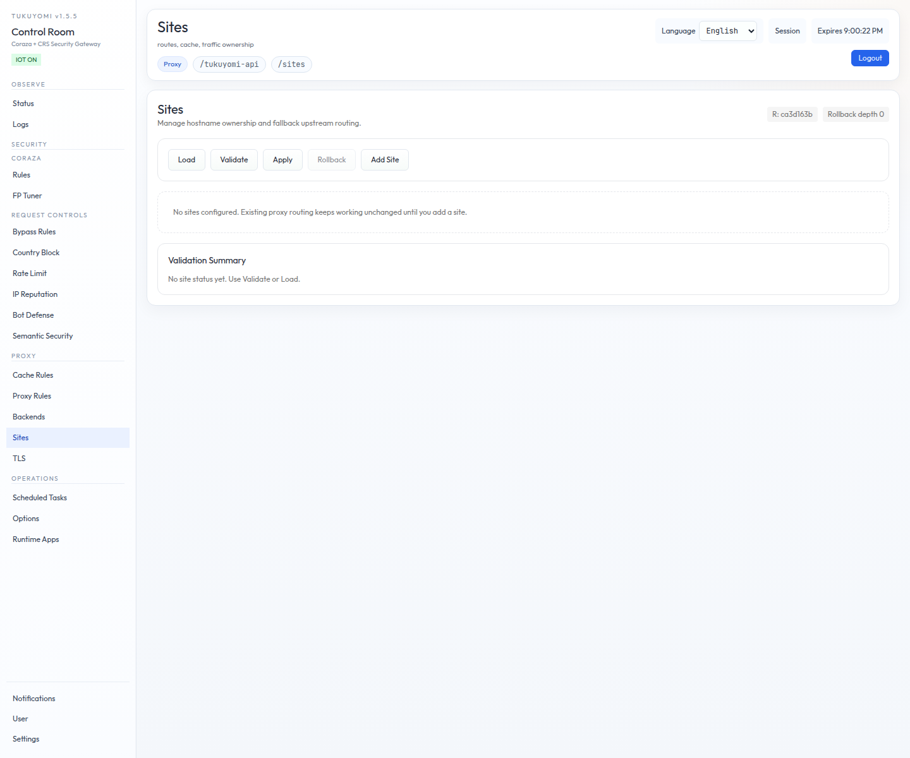

# 第15章　HTTP/3 と TLS

第14章までで listener topology の現在の判断と、その背後の根拠を共有しま
した。本章では、**その single listener の上で TLS と HTTP/3 をどう扱うか**
を扱います。具体的には次の 4 トピックです。

1. built-in TLS termination の有効化と各種 option
2. site-managed ACME（Let's Encrypt 自動証明書更新）
3. built-in HTTP/3 と `Alt-Svc` の挙動
4. HTTP/3 public-entry smoke で確認すべきこと

## 15.1　Built-in TLS Termination

tukuyomi は **built-in TLS termination** を持っています。前段に nginx や
ALB を挟まず、`tukuyomi` 自身を direct HTTPS entrypoint として使えます。

DB `app_config` の `server` block に、次のような TLS 設定を入れます。

```json
{
  "server": {
    "listen_addr": ":9443",
    "http3": {
      "enabled": true,
      "alt_svc_max_age_sec": 86400
    },
    "tls": {
      "enabled": true,
      "cert_file": "/etc/tukuyomi/tls/fullchain.pem",
      "key_file":  "/etc/tukuyomi/tls/privkey.pem",
      "min_version": "tls1.2",
      "redirect_http": true,
      "http_redirect_addr": ":9080"
    }
  }
}
```

要点は次のとおりです。

- `server.tls.enabled=false` が **既定**。
- `server.http3.enabled=true` には built-in TLS が必須。
- HTTP/3 は `server.listen_addr` と **同じ numeric port を UDP で** 使う。
- `server.tls.redirect_http=true` を入れると、plain HTTP listener が追加
  される（`http_redirect_addr` で listen address を指定）。
- ACME auto TLS は site ごとの `tls.mode=acme` で選ぶ。ACME account key、
  challenge token、証明書 cache は **`persistent_storage` の `acme/`
  namespace** に保存される。
- ACME HTTP-01 を使うため、port 80 を `server.tls.http_redirect_addr` に
  到達させること。
- Let's Encrypt の `staging` / `production` は site ごとの ACME environment
  で選択する。
- `paths.site_config_file` の既定は `conf/sites.json`。**DB-backed runtime
  では空 DB の seed / export path** であり、live source of truth ではない
  （第13章のルール）。

## 15.2　Inbound Timeout Boundary

TLS とは直接の関係は薄いですが、HTTPS / HTTP/3 を direct entrypoint として
公開するなら、**inbound timeout の境界** を理解しておくべきです。

- public HTTP/1.1 data-plane listener は、Tukuyomi native HTTP/1.1 server
  が処理する。admin listener、HTTP redirect listener、HTTP/3 helper は
  分離した control / edge helper のまま。
- `server.read_header_timeout_sec` は **request line と header のみ** に
  対する timeout。
- `server.read_timeout_sec` は **request line + header + body 全体** の
  inbound read budget。
- `server.write_timeout_sec` は **response write の上限**。slow client は
  data-plane goroutine を保持し続けず close する。
- `server.idle_timeout_sec` は keep-alive の **request 間 idle 時間** の
  上限。
- `server.graceful_shutdown_timeout_sec` は deploy / reload 時に live
  connection を drain する上限時間。**超過後は force close** する。
- TLS public listener は、この native server path では **HTTP/1.1 を
  advertise** する。HTTP/3 は有効時も **専用の HTTP/3 listener** で処理
  される。

## 15.3　Site-managed ACME

site-managed ACME は、`Sites` 画面で site ごとに **`tls.mode=acme`** を
選びます。`production` と `staging` は Let's Encrypt の本番 CA / staging CA
の選択で、account email は任意です。



ACME を使う場合の前提:

- HTTP-01 challenge を使うため、**port 80 を `server.tls.http_redirect_addr`
  に到達** させる必要がある。
- 取得した証明書 cache、ACME account key、challenge token は
  **`persistent_storage` の `acme/` namespace** に保存される。
- single-node の VPS / オンプレでは、`persistent_storage.local.base_dir`
  （既定 `data/persistent`）を **backup 対象** にしておく。
- replicated や node replacement を前提にするなら、**S3 backend または
  共有 mount** にしておく。Azure Blob / GCS は provider adapter が入る
  までは fail-closed。

第3章 3.5 節で扱った永続 byte storage の話と同じものを、ここでは「ACME
証明書がどこに行くか」という観点から再確認している、ということです。

## 15.4　Built-in HTTP/3

HTTP/3 を有効化する典型形は次です。

```json
{
  "server": {
    "listen_addr": ":443",
    "http3": {
      "enabled": true,
      "alt_svc_max_age_sec": 86400
    },
    "tls": {
      "enabled": true,
      "cert_file": "/etc/tukuyomi/tls/fullchain.pem",
      "key_file":  "/etc/tukuyomi/tls/privkey.pem",
      "redirect_http": true,
      "http_redirect_addr": ":80"
    }
  }
}
```

挙動の要点:

- HTTP/3 は **`listen_addr` と同じ numeric port を UDP で** 使う。たとえば
  `:443` なら **TCP/443 と UDP/443 を両方** open する必要がある。
- TLS public listener が HTTP/2 / HTTP/1.1 を扱い、HTTP/3 は **専用 listener**
  が扱う。
- HTTPS 応答に `Alt-Svc` を付与し、`alt_svc_max_age_sec` で advertise の
  TTL を制御する。
- HTTP/3 は **process replacement をまたいだ QUIC connection continuity を
  保証しない**（第4章 4.4 節）。task / pod 入れ替え中に client reconnect が
  発生し得る。

container 配備で HTTP/3 を有効化する場合は、listener port の **TCP / UDP
を両方 open** することを忘れないようにしてください（第4章 4.11 節）。

## 15.5　HTTP/3 Public-Entry Smoke

HTTP/3 の経路は環境依存が強いため、tukuyomi は **専用の smoke コマンド** を
用意しています。

```bash
make http3-public-entry-smoke
```

### 15.5.1　何を検証するか

この smoke は、一時的なローカル runtime を次の条件で起動します。

- **built binary**
- **built-in TLS を有効化**
- **built-in HTTP/3 を有効化**
- `127.0.0.1` と `localhost` 用の一時 self-signed certificate
- routed traffic 用のローカル echo upstream

これにより、次を保証します。

- **HTTPS listener が healthy になる**
- **HTTPS 応答に `Alt-Svc` が付く**
- HTTPS 入口でも routed proxy traffic が通る
- **`/tukuyomi-api/status` が `server_http3_enabled=true` と
  `server_http3_advertised=true` を返す**
- **live runtime に対して actual HTTP/3 request over UDP が成功する**

### 15.5.2　なぜ専用コマンドにしているか

この smoke は、次の前提があるため `make smoke` / `make deployment-smoke` /
`make ci-local` には **混ぜていません**。

- **TLS runtime の起動**
- **ローカルホスト上の UDP 利用可否**
- **一時 self-signed certificate**
- **Go 製の HTTP/3 probe**

release readiness や operator validation には有用ですが、通常の高速 smoke
に入れるには環境依存が強いためです。

### 15.5.3　前提条件

- Go toolchain
- Docker は **不要**
- `curl`, `jq`, `python3`, `rsync`, `install`
- ローカル UDP loopback が使えること

### 15.5.4　推奨タイミング

次のいずれかを変更した後に回すのが推奨です。

- `server.http3.*`
- built-in TLS listener の挙動
- `Alt-Svc` の扱い
- HTTPS / HTTP/3 listener pair に影響しうる startup 変更

また、`tukuyomi` を **direct HTTPS / HTTP/3 entrypoint として案内する前**
の専用確認にも向いています。前段に LB がある構成では smoke 自体は通りやすい
ですが、direct 公開の構成では一度ここを叩いておくと安心です。

## 15.6　ここまでの整理

- built-in TLS は `server.tls.enabled=true` で有効化、`http3.enabled=true`
  には TLS が必須。HTTP/3 は **同 numeric port を UDP** で使う。
- ACME auto TLS は `Sites` 画面で site ごとに `tls.mode=acme`、HTTP-01
  のため **port 80 forwarding が必須**。証明書 cache は
  `persistent_storage` の `acme/` namespace。
- inbound timeout は `read_header_timeout_sec` / `read_timeout_sec` /
  `write_timeout_sec` / `idle_timeout_sec` / `graceful_shutdown_timeout_sec`
  の 5 段階で boundary を作る。
- HTTP/3 を direct 公開するときは **TCP / UDP の両方** を開ける。
- HTTP/3 の確認は **`make http3-public-entry-smoke`** を別に回す。
  通常 smoke には混ぜない。

## 15.7　次章への橋渡し

第VI部もあと 1 章です。次の第16章では、Web / VPS の通常配備では OFF にして
おく optional 機能、**IoT / Edge デバイス登録（device-auth-enrollment）** を
扱います。Tukuyomi Center で承認された device identity を必要とする
deployment 向けの手順です。
