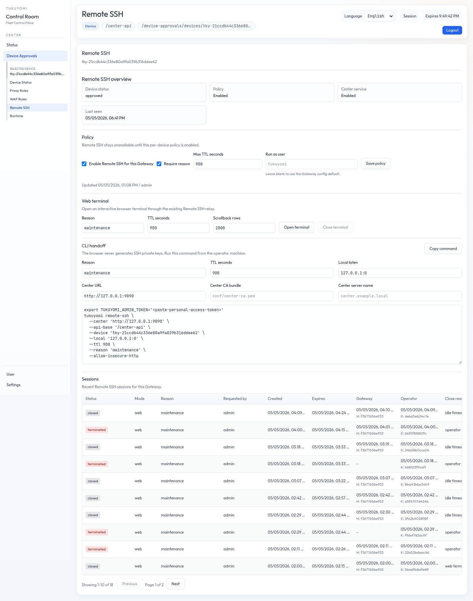

# 第17章　Remote SSH

本章では、承認済み Gateway へインバウンド SSH ポートを開けずに保守接続するための
**Remote SSH** を扱います。前章で説明した Center デバイス登録の上に乗る機能なので、
対象 Gateway は Center に登録され、デバイス承認が完了している必要があります。

Remote SSH は、短時間の運用作業を目的とした機能です。たとえば、ログ確認、ローカル状態の調査、
ローカルサービスの再起動、障害時の証跡採取に使います。リモートジョブ実行基盤、
ファイル転送システム、常時利用するシェルサービスとして扱わないでください。

## 17.1　使うべき場面

Remote SSH を使うのは、次の条件を満たす場合です。

- Gateway が Center 管理下にある
- Gateway への直接のインバウンド接続が使えない、または意図的に閉じている
- 運用者が短時間の対話型保守セッションを必要としている
- デバイスポリシーで許可され、接続理由が記録される

すべての環境で便利機能として有効化するものではありません。Remote SSH は Gateway 上の
シェルに到達できる強い機能です。運用モデル上必要な場合だけ有効化してください。

## 17.2　セキュリティモデル

Remote SSH は、Center、Gateway、運用者セッションの境界で権限を分離します。

| 境界 | 制御 |
|---|---|
| Center | Remote SSH サービスが有効であること、デバイスが承認済みであること、デバイスポリシーが Remote SSH を許可していること |
| Gateway | Remote SSH がローカル設定で有効であること、待機中セッションの署名を固定済み Center 署名鍵で検証できること |
| 運用者 | 接続理由と TTL が必須。Web Terminal と CLI セッションは使い捨ての運用者鍵を使う |
| セッション | TTL、アイドルタイムアウト、デバイスごとのセッション上限、監査項目、明示的な強制終了で寿命を制限する |

Gateway は Center へ **アウトバウンド** 接続します。Center や運用者向けに、
Gateway 側でインバウンド SSH リスナーを公開することはありません。

Gateway の組み込み SSH サーバーは、ポート転送、SFTP、SCP、SSH エージェント転送、
任意の SSH サブシステムを受け付けません。Gateway プロセスが root で動いている場合、
`run_as_user` が設定されていない限りシェルを起動しません。

## 17.3　Center / Gateway 設定

Remote SSH は既定では無効です。まず Center 側の Remote SSH サービスを有効化します。

```json
{
  "remote_ssh": {
    "center": {
      "enabled": true,
      "max_ttl_sec": 900,
      "idle_timeout_sec": 300,
      "max_sessions_total": 16,
      "max_sessions_per_device": 1
    }
  }
}
```

各 Gateway は、Center の署名鍵を信頼する必要があります。

```json
{
  "remote_ssh": {
    "gateway": {
      "enabled": true,
      "center_signing_public_key": "ed25519:REPLACE_WITH_CENTER_PUBLIC_KEY",
      "center_tls_ca_bundle_file": "conf/center-ca.pem",
      "center_tls_server_name": "center.example.local",
      "embedded_server": {
        "enabled": true,
        "shell": "/bin/sh",
        "working_dir": "/",
        "run_as_user": "tukuyomi"
      }
    }
  }
}
```

Center-protected install / preview では、初期設定処理が同じ信頼設定を Gateway 設定に書き込みます。
手動で配備する場合は、Center の署名公開鍵を次のエンドポイントから取得します。

```text
/center-api/remote-ssh/signing-key
```

## 17.4　Center UI での操作

`Device Approvals` を開き、対象 Gateway を選んで `Manage` を押します。
選択中デバイスのメニューに `Remote SSH` が表示されます。



この画面には、運用者向けに 3 つの領域があります。

- **Policy**: この Gateway の Remote SSH 許可、最大 TTL、実行ユーザー、接続理由必須の設定を管理します。
- **Web terminal**: Remote SSH の中継経路を通して、ブラウザー上の対話型ターミナルを開きます。
- **CLI handoff**: 手元の SSH クライアントを使う運用者向けに、`tukuyomi remote-ssh` コマンドを表示します。

Web Terminal を使う手順は次のとおりです。

1. Center 側の Remote SSH サービスが ON であることを確認する
2. デバイスポリシーを有効化する
3. 接続理由を入力する
4. TTL seconds を指定する
5. ブラウザー側のスクロールバック行数が多すぎる、または少なすぎる場合は `Scrollback rows` を調整する
6. `Open terminal` を押す

Center は待機中セッションをすぐに作成します。ブラウザーの WebSocket 接続は開きますが、
Gateway が次回の署名付きステータスのポーリングでセッションを取得するまで待機します。
ポーリング間隔が 30 秒であれば、ポーリング 1 回分程度の待ち時間は正常に起こりえます。
それを大きく超える場合は、異常として調査してください。

## 17.5　CLI handoff

CLI 導線も引き続き使えます。

```bash
export TUKUYOMI_ADMIN_TOKEN="$TOKEN"
tukuyomi remote-ssh \
  --center "https://center.example.com" \
  --center-ca-bundle "conf/center-ca.pem" \
  --center-server-name "center.example.local" \
  --device "$DEVICE" \
  --reason "maintenance"
```

このコマンドは、実際に実行するローカルの `ssh` コマンドを表示し、
SSH セッションが有効な間は中継経路を開いたままにします。CLI 導線は、緊急運用、
自動化、ブラウザーターミナルが適さない環境で使います。

## 17.6　セッション履歴と強制終了

Sessions の表には、選択中 Gateway の最近の Remote SSH セッションが表示されます。
待機中または接続中のセッションでは、ステータス欄から強制終了できます。
セッションを強制終了すると、対応する Web Terminal または CLI の中継接続が閉じられ、
デバイスごとのセッション上限も解放されます。

Web Terminal の `Scrollback rows` は、ブラウザー側のスクロールバック行数です。
サーバー側の操作記録ではありません。コマンド記録やターミナル全体の記録が必要な環境では、
スクロールバックを証跡扱いせず、別の監査記録機能として設計してください。

## 17.7　トラブルシューティング

| 症状 | 原因と対処 |
|---|---|
| `Open terminal` 後、接続まで少し待つ | Gateway の次回 Center ステータスのポーリングまでは正常に待つ。ポーリング間隔と `Last seen` を確認する |
| ターミナルが接続されない | Center 側の Remote SSH サービス、デバイス承認、デバイスポリシー、Gateway の Remote SSH ローカル設定、Center 署名鍵の信頼設定を確認する |
| セッションが突然閉じる | TTL、アイドルタイムアウト、明示的な強制終了、Gateway ログを確認する |
| CLI が HTTP の Center URL を拒否する | HTTPS が既定。HTTP はローカル検証で、安全でない HTTP を許可するフラグを明示した場合だけ使う |
| Gateway が root でのシェル起動を拒否する | `remote_ssh.gateway.embedded_server.run_as_user` を設定する |

## 17.8　ここまでの整理

- Remote SSH は、Gateway のインバウンド SSH を公開せずに短時間の保守接続を提供する。
- Web Terminal を通常の Center UI 導線とし、CLI handoff は高度な運用や緊急対応向けに残す。
- Center のポリシー、Gateway のローカル設定、使い捨て鍵、TTL、アイドルタイムアウト、監査項目でセッションを制限する。
- ブラウザーのスクロールバックは表示履歴であり、監査記録ではない。

## 17.9　次章への橋渡し

第VI部はここで終わりです。第VII部では、性能と回帰検証を扱います。第18章では、
ベンチマークコマンド、スモークテストのマトリクス、リリースバイナリのスモークテスト、
リリース前にどの確認をどこまで積み上げるかを整理します。
